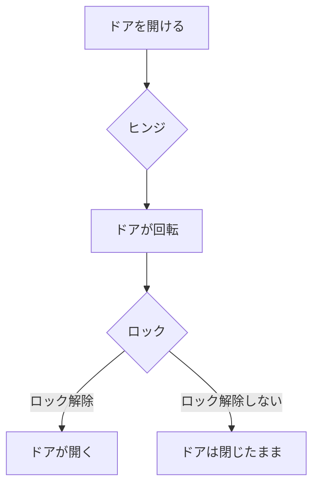

# Day 001: 機構部品（金具）とは何か

機構部品、または金具とは、機械や装置の一部として機能する部品のことを指します。これらは、日常生活や産業のあらゆる場面で使用され、機械の動きを支えたり、構造を安定させたりする重要な役割を担っています。

## 機構部品の種類と役割

機構部品は、その用途や機能に応じて様々な種類があります。以下に代表的なものをいくつか紹介します。

1. **ヒンジ**: 扉や蓋を開閉するための部品です。例えば、家庭のドアやキャビネットの扉に使われています。ヒンジは、回転運動を可能にし、スムーズな開閉を実現します。

2. **ロック**: 安全性を確保するために使用される部品です。ロックは、扉や引き出しが不意に開かないようにし、内容物を保護します。

3. **ハンドル**: 扉や引き出しを開け閉めするための取っ手です。ハンドルは、人が力を加えやすい形状になっており、操作性を向上させます。

4. **スライドレール**: 引き出しや棚を滑らかに動かすための部品です。スライドレールは、直線運動をサポートし、物の出し入れを容易にします。

これらの部品は、タキゲンやシブタニ、栃木屋、スガツネといったメーカーが提供しており、用途に応じた様々な製品がラインナップされています。

## 図で理解する

以下のフローチャートは、簡単な機構部品の動作を示しています。例えば、ドアの開閉におけるヒンジとロックの役割を視覚的に理解することができます。

## 今日のポイント
- 機構部品（金具）は、機械や装置の動きを支える重要な役割を持つ。
- ヒンジ、ロック、ハンドル、スライドレールなど、用途に応じた様々な種類がある。
- 各部品は、動きや役割に応じて設計され、日常生活や産業で広く利用されている。

## 明日へのつながり
明日は、具体的な機構部品の選び方や使用方法について、さらに詳しく学んでいきましょう。これにより、実際の現場での応用力を高めることができます。
