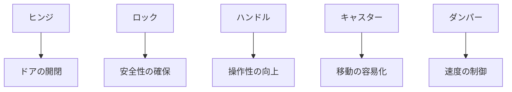

# Day 002: 4社に共通する製品カテゴリの全体像

産業用機構部品の世界では、特定のメーカーに依存せずに共通して使用される製品カテゴリがあります。これらの部品は、さまざまな産業で機械や装置の一部として不可欠な役割を果たしています。今日は、タキゲン、シブタニ、栃木屋、スガツネの4社に共通する製品カテゴリを理解し、その全体像を掴むことを目指します。

## 主要な製品カテゴリ

1. **ヒンジ（蝶番）**  
   ヒンジは、ドアや蓋などを開閉するための部品です。2つの物体をつなぎ、一定の範囲で回転運動を可能にします。例えば、キャビネットのドアを開け閉めする際に使われます。

2. **ロック（錠前）**  
   ロックは、物を固定したり、開閉を制限するための部品です。安全性を確保するために重要で、例えば、金庫やドアの施錠に使われます。

3. **ハンドル**  
   ハンドルは、物を操作するための取っ手です。ドアや引き出しを開けるための手がかりとして使われ、操作性を向上させます。

4. **キャスター（車輪）**  
   キャスターは、移動を容易にするために取り付けられる車輪です。機械や家具の底に取り付けられ、移動をスムーズにします。

5. **ダンパー**  
   ダンパーは、動きの速度を制御するための部品です。例えば、ドアが閉まる速度を調整し、衝撃を和らげます。

これらの部品は、異なるメーカーでも共通の機能を持ち、産業界で広く使用されています。それぞれの部品は、特定の役割を果たし、機械や装置の動きを支えています。

## 図で理解する

## 今日のポイント
- **ヒンジ、ロック、ハンドル、キャスター、ダンパー**は、産業用機構部品の基本的なカテゴリ。
- 各部品は、特定の機能を持ち、機械や装置の動きを支える。
- これらの部品は、異なるメーカーでも共通の役割を果たす。

## 明日へのつながり
明日は、これらの部品が具体的にどのように使われているか、実際の応用例を通じて理解を深めていきます。
