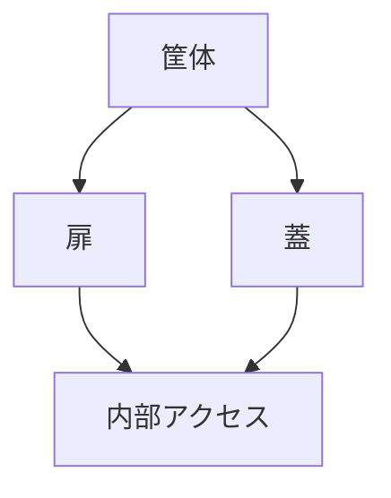

# Day 003: 筐体・扉・蓋という前提を理解する

産業用機構部品の世界では、「筐体（きょうたい）」「扉」「蓋（ふた）」といった用語が頻繁に登場します。これらは機械や装置の構造を理解する上で重要な要素です。今回は、これらの基本的な役割と仕組みを図面が読めない方でも理解できるように解説します。

## 筐体とは？

筐体とは、機械や電子機器を保護し、その内部にある部品を支える構造体です。例えば、コンピュータのケースや工場の制御盤が筐体に該当します。筐体は内部の部品を外部の衝撃や環境から守る役割を持ちます。また、筐体には通気口やケーブルを通すための穴が設けられていることが多く、これにより機器の冷却や配線が可能になります。

## 扉と蓋の役割

扉と蓋は、筐体に設けられた開閉可能な部分です。扉は通常、頻繁に開閉されることを前提としており、メンテナンスや操作が必要な部分に設けられます。一方、蓋は、内部の部品を保護しつつ、必要に応じて開けることができる構造です。蓋は、通常は閉じた状態で使用され、開ける頻度は扉よりも少ないことが一般的です。

## 筐体、扉、蓋の相互作用

これらの要素は、以下のように相互作用して機器を保護し、操作を容易にします。

1. **筐体**は全体を覆い、内部の部品を保護します。
2. **扉**は、定期的な操作やメンテナンスのために開閉が容易で、内部へのアクセスを提供します。
3. **蓋**は、通常は閉じた状態で内部を保護し、必要に応じて開けることができます。

## 図で理解する

以下の図は、筐体、扉、蓋の基本的な関係を示しています。

## 今日のポイント
- **筐体**は機器全体を保護し、内部の部品を支える役割を持つ。
- **扉**は頻繁に開閉される部分で、操作やメンテナンスがしやすい。
- **蓋**は通常閉じた状態で使用され、必要に応じて開けることで内部を保護する。

## 明日へのつながり

次回は、これらの筐体、扉、蓋に関連する具体的な金具や部品について学び、どのように選定されるかを理解していきます。
