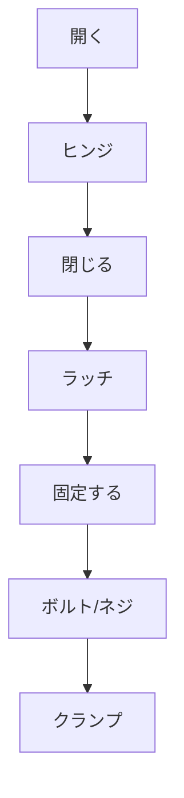

# Day 004: 「開く・閉じる・固定する」の3動作

産業用機構部品の基本的な役割には、「開く」「閉じる」「固定する」の3つの動作があります。これらの動作は、日常生活でもよく目にする動作ですが、産業用の環境では特に重要です。今日は、これらの動作がどのように機構部品によって実現されているのかを学びます。

## 開く

「開く」という動作は、扉や蓋などを動かして内部にアクセスするための動作です。例えば、ヒンジ（蝶番）は扉をスムーズに開くための部品です。ヒンジは、2つの部品を軸でつなぎ、回転させることで開閉を可能にします。これにより、扉が滑らかに開くことができます。

## 閉じる

「閉じる」は、開いた状態を元に戻す動作です。産業用の環境では、確実に閉じることが求められます。例えば、ラッチは扉や蓋をしっかりと閉じた状態に保つための部品です。ラッチは、扉が閉じたときに自動的に固定され、外部からの衝撃や振動でも開かないようにします。

## 固定する

「固定する」は、開閉した状態を維持するための動作です。これには、ボルトやネジ、クランプなどが用いられます。これらの部品は、扉や蓋を開いた状態や閉じた状態でしっかりと固定する役割を果たします。特に、機械が振動する環境では、固定が重要です。

これらの動作は、以下のように組み合わせて使用されることが多いです。

## 図で理解する

## 今日のポイント
- **開く**: ヒンジを使ってスムーズに動かす
- **閉じる**: ラッチで確実に閉じる
- **固定する**: ボルトやネジで状態を維持する

## 明日へのつながり
次回は、これらの動作を実際の産業用機器でどのように応用しているかを具体的に見ていきます。これにより、機構部品の選び方や使い方がより理解しやすくなるでしょう。
