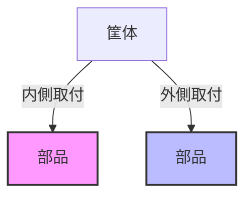

# Day 005: 内側取付と外側取付の違い

産業用機構部品の取り付け方法には、大きく分けて「内側取付」と「外側取付」の2種類があります。これらは、部品が取り付けられる位置や方法によって区別され、用途や目的に応じて使い分けられます。今回は、図面が読めなくても理解できるように、内側取付と外側取付の基本的な違いを解説します。

## 内側取付とは

内側取付は、部品を筐体（きょうたい）や扉の内側に取り付ける方法です。例えば、扉を閉じたときに見えないようにするために、ヒンジやラッチといった部品が内側に取り付けられます。この方法は、外観をすっきりと見せたい場合や、部品が外部からの衝撃や汚れにさらされないようにするために選ばれます。

内側取付の利点は、部品が外部から見えないため、デザイン性が向上することです。また、部品が外部環境から保護されるため、耐久性が高まるというメリットもあります。

## 外側取付とは

外側取付は、部品を筐体や扉の外側に取り付ける方法です。こちらは、部品が見える位置に取り付けられるため、操作性やメンテナンス性を重視する場合に適しています。例えば、取っ手やロック機構など、頻繁に操作する部品は外側に取り付けられることが多いです。

外側取付の利点は、部品が容易にアクセスできるため、操作やメンテナンスがしやすいことです。また、部品が見えるため、状態の確認がしやすいというメリットもあります。

## 図で理解する

以下の図は、内側取付と外側取付の違いを示しています。筐体の断面を示し、どのように部品が取り付けられるかを視覚的に理解できます。

## 今日のポイント
- **内側取付**は、部品を筐体や扉の内側に取り付け、外観をすっきりさせる。
- **外側取付**は、部品を筐体や扉の外側に取り付け、操作性やメンテナンス性を重視する。
- 取り付け方法の選択は、用途や目的によって異なる。

## 明日へのつながり

明日は、具体的な部品の種類とその取り付け方法について詳しく学び、どのように選択されるかを理解しましょう。
