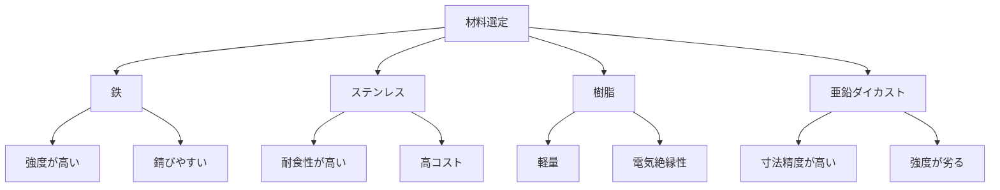

# Day 006: 材料の基礎（鉄・ステンレス・樹脂・亜鉛ダイカスト）

産業用機構部品において、材料の選択は非常に重要です。今日は、鉄、ステンレス、樹脂、亜鉛ダイカストという4つの主要な材料について、その特性と用途を学びます。これらの材料は、機構部品の性能や耐久性、コストに大きく影響を与えます。

## 鉄

鉄は、最も一般的に使用される金属材料の一つです。強度が高く、加工しやすいという特性があります。鉄は、コストパフォーマンスが良いため、多くの産業用部品に利用されています。しかし、錆びやすいという欠点がありますので、表面処理を施すことが一般的です。

## ステンレス

ステンレスは、鉄にクロムを加えた合金で、錆びにくい特性があります。耐食性が高く、見た目も美しいため、屋外や湿気の多い環境で使用されることが多いです。ただし、鉄よりもコストが高く、加工がやや難しいという面もあります。

## 樹脂

樹脂は、プラスチックとも呼ばれ、軽量で耐候性に優れています。電気絶縁性があるため、電気部品のケースなどに利用されます。成形が容易で、複雑な形状を作ることができるのも特徴です。しかし、強度が金属に比べて劣るため、用途に応じた選択が必要です。

## 亜鉛ダイカスト

亜鉛ダイカストは、亜鉛を主成分とする合金を型に流し込んで成形する方法です。寸法精度が高く、複雑な形状を一体で作ることができます。耐食性も比較的良く、コストも抑えられますが、鉄やステンレスに比べると強度が劣るため、適切な用途での使用が求められます。

## 図で理解する

## 今日のポイント
- **鉄**は強度が高くコストパフォーマンスが良いが、錆びやすい。
- **ステンレス**は耐食性に優れるが、コストが高く加工が難しい。
- **樹脂**は軽量で成形が容易だが、強度が金属に劣る。

## 明日へのつながり
明日は、これらの材料をどのように選定し、実際の製品に適用するかについて学びます。材料選定の基準や具体例を通じて、より深い理解を目指しましょう。
