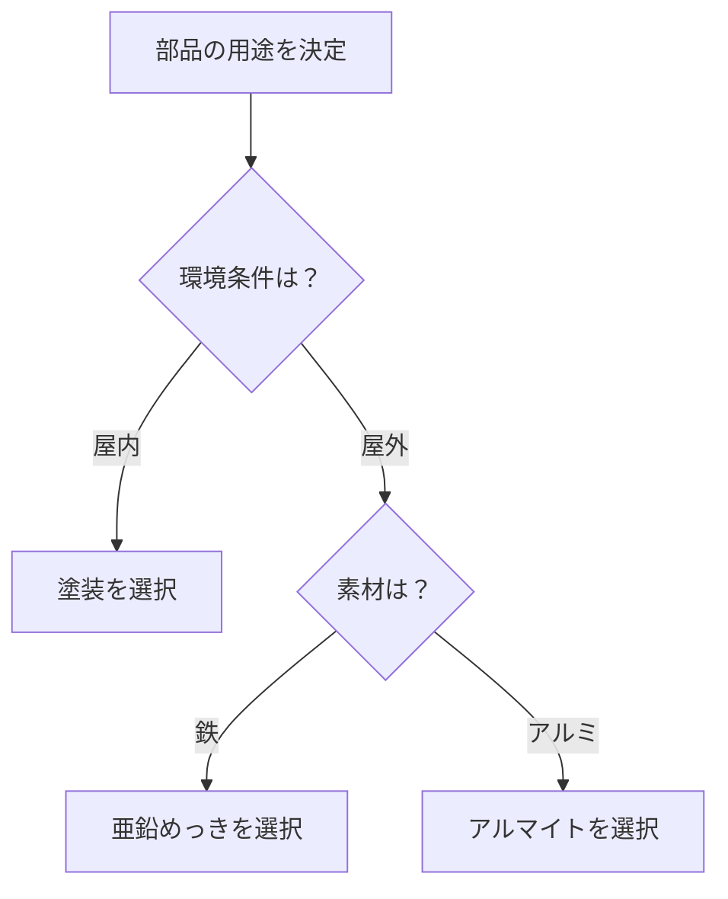

# Day 007: 表面処理の読み方（めっき・塗装・アルマイト）

産業用機構部品は、環境や用途に応じて表面処理が施されています。この処理により、部品の耐久性や美観が向上します。今回は、代表的な表面処理である「めっき」「塗装」「アルマイト」について、その仕組みと役割を学びましょう。

## めっき

めっきは、金属の表面に別の金属を薄くコーティングする技術です。これにより、錆びにくくしたり、電気伝導性を向上させたりします。例えば、亜鉛めっきは鉄を錆から守るために広く使われています。

## 塗装

塗装は、部品の表面に塗料を塗布することで保護膜を作る方法です。塗装は防錆効果だけでなく、色や質感を調整する役割も持ちます。例えば、屋外で使用される部品は、紫外線や雨風から守るために耐候性の高い塗料が使用されます。

## アルマイト

アルマイトは、アルミニウムの表面に酸化皮膜を形成する処理です。これにより、耐食性や耐摩耗性が向上します。アルマイト処理された部品は、軽量でありながら高い耐久性を持ち、航空機や自動車などで利用されています。

## 図で理解する

以下のフローチャートで、表面処理の選択プロセスを簡単に示します。

## 今日のポイント
- **めっき**は、金属の表面に別の金属をコーティングし、耐食性を向上させる。
- **塗装**は、塗料を使って部品を保護し、色や質感を調整する。
- **アルマイト**は、アルミニウムの表面に酸化皮膜を形成し、耐久性を高める。

## 明日へのつながり
明日は、表面処理が施された部品のメンテナンス方法について学びます。これにより、長期間にわたって部品の性能を維持するための知識を深めましょう。
