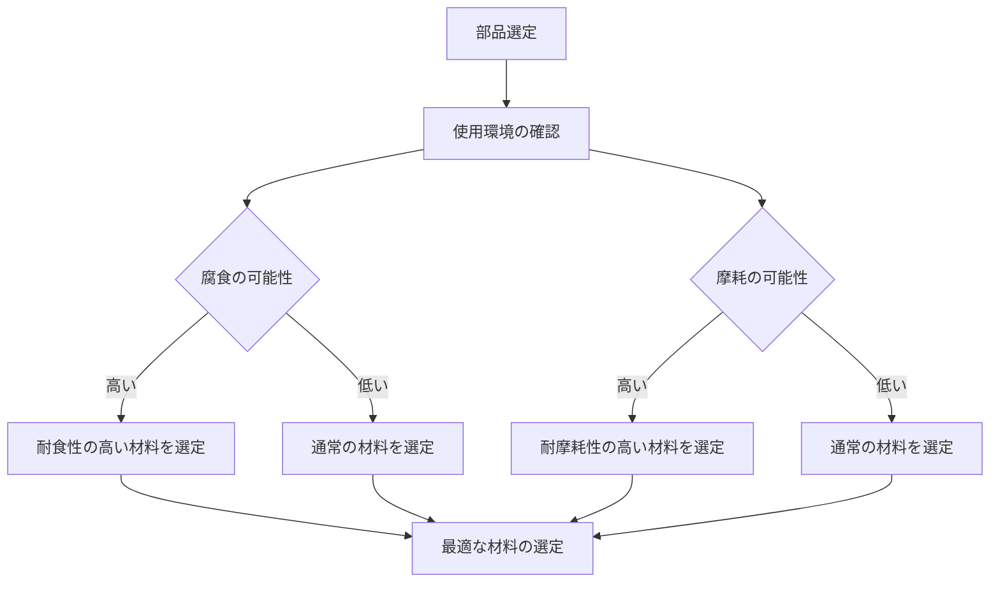

# Day 008: 耐食性・耐摩耗性とは

産業用機構部品の設計や選定において、「耐食性」と「耐摩耗性」は非常に重要な特性です。これらは部品の寿命や性能に大きく影響を与えます。今日の学習では、これらの特性がどのように機能し、どのように考慮されるべきかを理解しましょう。

## 耐食性とは

耐食性とは、材料が腐食（さびや劣化）に対する抵抗力を持つことを指します。腐食は、金属が酸素や水分と反応して化学的に変質する現象です。例えば、鉄が錆びるのは酸化鉄が生成されるからです。耐食性の高い材料としてはステンレス鋼や特定の合金があり、これらは表面に保護膜を形成して腐食を防ぎます。

### 耐食性が重要な理由
1. **長寿命化**: 腐食を防ぐことで部品の寿命を延ばすことができます。
2. **安全性の確保**: 構造部品が腐食すると強度が低下し、事故の原因となる可能性があります。
3. **コスト削減**: メンテナンスや交換の頻度が減るため、長期的にコストを抑えられます。

## 耐摩耗性とは

耐摩耗性は、材料が摩擦による物理的な損傷に対してどれだけ耐えられるかを示します。摩耗は、部品が動作中に他の部品と接触することで表面が削られる現象です。耐摩耗性の高い材料には、特殊な表面処理を施した金属やセラミックが含まれます。

### 耐摩耗性が重要な理由
1. **性能の維持**: 摩耗が進むと部品の精度が落ち、機械全体の性能に影響を与えます。
2. **信頼性の向上**: 摩耗に強い部品は故障しにくく、機械の信頼性を高めます。
3. **運用コストの低減**: 頻繁な交換が不要になるため、運用コストを抑えられます。

## 図で理解する

以下のフローチャートは、耐食性と耐摩耗性がどのように部品選定に影響を与えるかを示しています。

## 今日のポイント
- **耐食性**は材料の腐食に対する抵抗力であり、部品の寿命や安全性に直結します。
- **耐摩耗性**は摩擦による損傷に対する抵抗力で、機械の性能や信頼性を維持します。
- 部品選定では、使用環境に応じた耐食性と耐摩耗性のバランスが重要です。

## 明日へのつながり
次回は、耐食性や耐摩耗性をさらに高めるための具体的な表面処理技術について学びます。これにより、より実践的な部品選定のスキルを身につけましょう。
