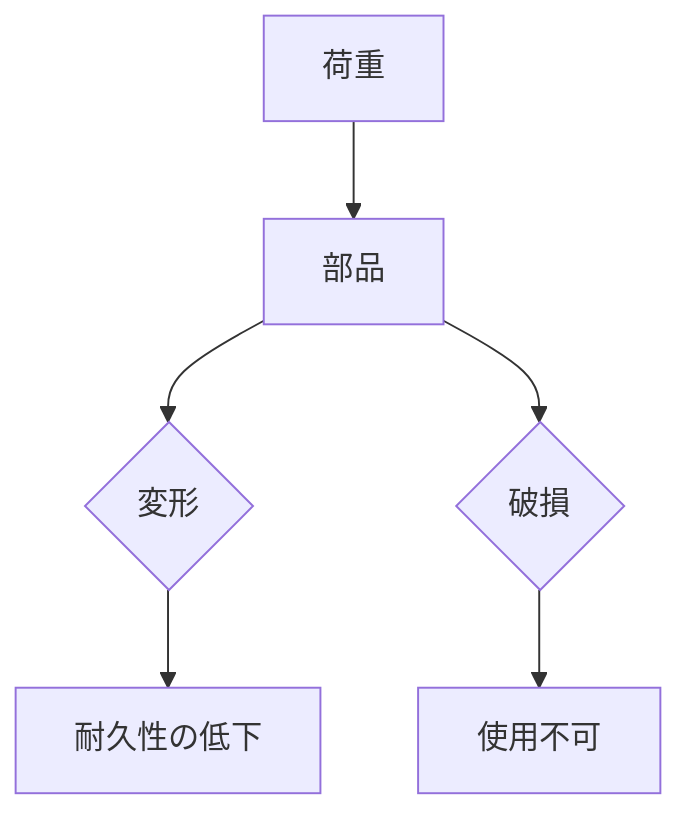

# Day 009: 荷重という言葉の意味

産業用機構部品の世界では、「荷重」という言葉が頻繁に登場します。これは、部品や構造物にかかる力のことを指します。荷重は、部品の選定や設計において非常に重要な要素であり、適切に理解することが求められます。

## 荷重の基本概念

荷重にはいくつかの種類があります。一般的には、以下のような分類がされます。

1. **静荷重**: 時間の経過とともに変化しない一定の荷重。例えば、棚に置かれた物の重さ。
2. **動荷重**: 時間とともに変化する荷重。例えば、エレベーターの動きによって変わる力。
3. **衝撃荷重**: 短時間で大きな力が加わる荷重。例えば、ハンマーで叩く力。

これらの荷重は、部品の設計や選定に大きな影響を与えます。例えば、ドアのヒンジは開閉時に動荷重がかかるため、その耐久性が重要です。

## 荷重の影響

荷重が部品に与える影響は様々です。最も一般的な影響は、部品の変形や破損です。過剰な荷重がかかると、部品が曲がったり、最悪の場合は破壊されることがあります。これを防ぐために、部品は通常、予想される最大荷重よりも高い荷重に耐えられるように設計されています。

## 図で理解する

以下の図は、荷重がどのように部品に影響を与えるかを示しています。

## 今日のポイント
- 荷重は部品や構造物にかかる力の総称である
- 荷重には静荷重、動荷重、衝撃荷重などがある
- 荷重が部品に与える影響を理解することが重要

## 明日へのつながり
明日は、荷重に対する部品の「強度」について学びます。強度は、荷重に耐えるための部品の能力を示す重要な要素です。
