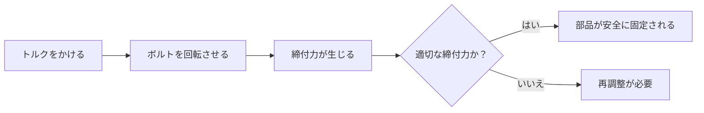

# Day 010: トルク・締付力の基礎

今日は、産業用機構部品の設計や組立において重要な「トルク」と「締付力」について学びます。これらは、部品を安全かつ確実に固定するために不可欠な概念です。

## トルクとは

トルクとは、物体を回転させる力のことです。例えば、ドアノブを回すときに必要な力をイメージしてください。トルクは「力 × 距離」で表され、単位はニュートンメートル（Nm）です。ドライバーやレンチを使ってボルトを締める際に、どれだけの力で回すかを示す指標となります。

## 締付力とは

締付力は、ボルトやナットを締め付けたときに生じる力です。この力は、部品同士をしっかりと固定し、振動や衝撃による緩みを防ぎます。適切な締付力を得るためには、適切なトルクが必要です。

## トルクと締付力の関係

トルクと締付力は密接に関連しています。トルクを適切に調整することで、必要な締付力を得ることができます。過剰なトルクは部品の破損やネジの変形を引き起こし、不足するトルクは緩みの原因となります。

## 図で理解する

以下のフローチャートは、トルクと締付力の関係を示しています。

## 今日のポイント
- **トルク**は物体を回転させる力であり、適切な締付力を得るために重要です。
- **締付力**は部品を固定する力で、振動や衝撃による緩みを防ぎます。
- トルクと締付力のバランスを正しく調整することが、部品の安全性と信頼性を確保する鍵です。

## 明日へのつながり
明日は、トルクと締付力を実際にどのように測定し、管理するかについて詳しく学びます。これにより、実務での応用力を高めていきましょう。
