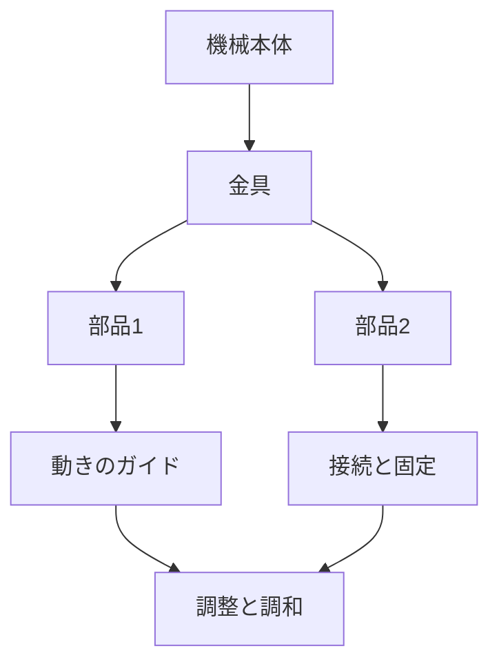

# Day 011: 産業機器での金具の役割

産業機器における金具は、機械や装置の動きを支える重要な部品です。金具は、部品同士をつなぎ、動きをスムーズにする役割を果たします。例えば、ドアを開閉する際のヒンジや、パネルを固定するためのロック機構などが金具の一例です。これらの金具は、機械の安全性や効率性を高めるために欠かせません。

金具は、以下のような役割を持っています。

1. **接続と固定**: 金具は、異なる部品をしっかりと接続し、固定する役割を持ちます。これにより、機械全体の安定性が保たれます。例えば、タキゲンや栃木屋の製品には、さまざまな形状や材質のヒンジやロックがあり、用途に応じた選択が可能です。

2. **動きのガイド**: 金具は、部品の動きをガイドする役割もあります。スライドレールやキャスターなどは、部品の移動をスムーズにし、摩擦を減らすことで機械の効率を高めます。

3. **調整と調和**: 金具は、機械の微調整を可能にします。例えば、スガツネの調整可能なヒンジは、扉の位置や角度を微調整することで、使用時の快適さを向上させます。

これらの役割を果たすために、金具は耐久性や耐食性に優れた材料で作られています。また、表面処理が施されていることも多く、長期間の使用に耐える設計がされています。

## 図で理解する

## 今日のポイント
- 金具は、機械の部品を接続・固定する役割を持つ。
- 金具は、部品の動きをスムーズにするガイドの役割も果たす。
- 金具は、機械の調整を可能にし、全体の調和を保つ。

## 明日へのつながり
明日は、具体的な金具の種類とその選び方について学びます。どのようにして適切な金具を選ぶかを理解することで、機械の性能を最大限に引き出す方法を探ります。
