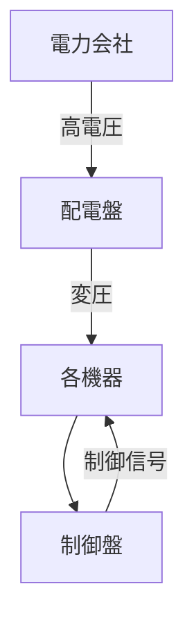

# Day 012: 配電盤・制御盤での使われ方

配電盤や制御盤は、工場やビルなどで電気を安全に、効率よく使うために欠かせない設備です。これらは、電気を分配したり、機械の動きを制御したりする役割を持っています。図面が読めなくても、その基本的な仕組みを理解することは可能です。

## 配電盤とは？

配電盤は、電力を各機器に分配するための装置です。電力会社から供給される高電圧の電気を、適切な電圧に変換し、各機器に送り届けます。これにより、機器が安全に動作するための電力が確保されます。

### 配電盤の主な構成要素

- **ブレーカー**: 電流が過剰になると自動で電気を遮断し、火災などの事故を防ぎます。
- **トランスフォーマー（変圧器）**: 電圧を変換します。高電圧を低電圧にすることで、家庭用や工場用の機器に適した電力を供給します。
- **バスバー**: 電気を効率よく分配するための導体です。

## 制御盤とは？

制御盤は、機械や設備の動きを制御するための装置です。工場の生産ラインやビルの空調システムなど、さまざまな機器の動作を管理します。

### 制御盤の主な構成要素

- **リレー**: 電気信号を受けて、機械の動作を制御するスイッチの役割を果たします。
- **プログラマブル・ロジック・コントローラー（PLC）**: 機械の動作をプログラムで制御する装置です。複雑な動作を正確に実行できます。
- **端子台**: 各機器との接続を簡単にするための部品です。

## 図で理解する

以下の図は、配電盤と制御盤の基本的な流れを示しています。

## 今日のポイント
- **配電盤は電力を分配し、機器に適した電圧を供給する装置です。**
- **制御盤は機械の動作を管理し、効率的な運用を可能にします。**
- **ブレーカーやリレーなどの部品が安全で効率的な運用を支えています。**

## 明日へのつながり

明日は、配電盤や制御盤で使用される具体的な機構部品について学びます。これにより、さらに深い理解が得られるでしょう。
