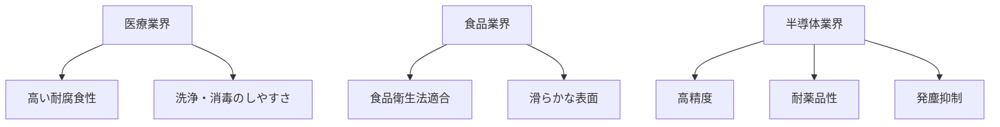

# Day 013: 医療・食品・半導体向けの違い

産業用機構部品は、使用される業界によって求められる特性や基準が異なります。今回は、医療、食品、そして半導体業界における機構部品の違いについて学びます。これらの業界では、製品の安全性や品質が特に重要視されるため、使用される部品にも厳しい基準が設けられています。

## 医療業界

医療機器は人の命に関わるため、非常に高い安全性と信頼性が求められます。例えば、手術器具や診断装置に使われる金具は、耐腐食性や耐久性が高い材料で作られている必要があります。また、清潔さを保つために、洗浄や消毒がしやすい設計が求められます。医療用の部品は、国際的な規格に従って製造されることが多く、品質管理も厳しく行われます。

## 食品業界

食品業界では、衛生管理が最優先されます。食品に直接触れる部分は、食品衛生法に適合した材料で作られている必要があります。例えば、ステンレス鋼や特定のプラスチックがよく使われます。また、食品の加工や包装機械に使用される部品は、洗浄が容易で、細菌の繁殖を防ぐ設計が求められます。食品業界では、部品の表面が滑らかで、汚れが付きにくいことも重要です。

## 半導体業界

半導体製造は、微細な加工を必要とするため、非常に高精度な部品が求められます。クリーンルーム環境での使用が前提となるため、部品からの発塵（ほこりや微細な粒子の発生）が極力抑えられることが重要です。また、化学薬品を使用する工程が多いため、耐薬品性が高い材料が必要です。さらに、温度や湿度の変化に対しても安定した性能を発揮することが求められます。

## 図で理解する

## 今日のポイント
- **医療業界**では、安全性と信頼性が最優先される。
- **食品業界**では、衛生管理が最重要であり、洗浄のしやすさが求められる。
- **半導体業界**では、高精度と耐薬品性が必要で、発塵を抑えることが重要。

## 明日へのつながり

明日は、これらの業界で使用される具体的な部品例について詳しく学び、どのようにしてこれらの特性が実現されているのかを見ていきます。
