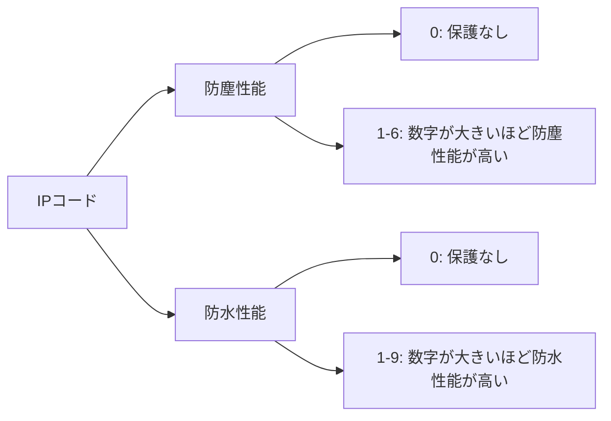

# Day 014: 防塵・防水の考え方（IPの基礎）

産業用機器や部品を扱う際に、よく耳にするのが「IPコード」です。このIPコードは、製品がどの程度の防塵（ほこりの侵入を防ぐ）や防水（液体の侵入を防ぐ）性能を持っているかを示す国際規格です。IPとは「Ingress Protection」の略で、日本語では「侵入保護」と訳されます。

IPコードは通常、「IP」＋「数字2桁」で表されます。最初の数字は防塵性能を示し、0から6までの範囲で評価されます。0は保護なし、6は完全な防塵性能を意味します。次に、2番目の数字は防水性能を示し、0から9までの範囲で評価されます。0は保護なし、9は高圧水流に対しても防水性能があることを示します。

例えば、「IP67」と表示されている場合、6は完全な防塵性能を、7は一時的な水没に耐えられる防水性能を意味します。このような表示は、製品がどのような環境で使用できるかを判断する重要な指標となります。

## 図で理解する

以下に、IPコードの基本的な考え方を視覚的に示します。

## 今日のポイント
- **IPコードとは何か**: 製品の防塵・防水性能を示す国際規格。
- **数字の意味**: 最初の数字は防塵性能、次の数字は防水性能を示す。
- **実用例**: IP67などの具体例を通じて、どのような環境で使用できるかを判断。

## 明日へのつながり
明日は、実際に防塵・防水性能が求められる具体的な産業用機器の例を通じて、IPコードの重要性をさらに深く理解していきます。
