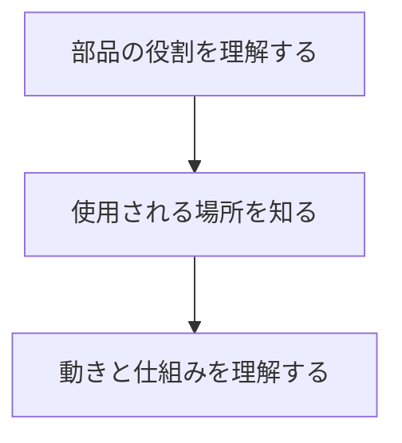

# Day 015: 図面が読めなくても覚える順番

図面が読めないというのは、異業種から転職したばかりの方にとっては大きな壁かもしれません。しかし、図面の詳細を理解する前に、まずは産業用機構部品の基本的な役割や使われ方を順序立てて理解することが重要です。今日はその順番を学びましょう。

## 1. 部品の役割を理解する

まずは、各部品がどのような役割を果たしているのかを理解します。産業用機構部品には、例えば「固定する」「動かす」「支える」「閉じる」などの基本的な役割があります。これらの役割を知ることで、部品がどのように機械や装置に組み込まれているのかが見えてきます。

## 2. 使用される場所を知る

次に、部品がどのような場所で使用されるのかを学びます。例えば、タキゲンやシブタニ、栃木屋、スガツネなどのメーカーは、それぞれ異なる用途に特化した製品を提供しています。これらのメーカーのウェブサイトを参考にしながら、部品がどのような環境で使用されるのかを把握しましょう。

## 3. 動きと仕組みを理解する

最後に、部品の動きと仕組みを理解します。これは、図面を読むことなく、実際に部品を手に取って動かしてみることで得られる感覚です。動きの種類や仕組みを理解することで、図面を読まなくても部品の機能をイメージできるようになります。

## 図で理解する

以下は、部品の役割と使用場所、動きの関係を示したフローチャートです。

## 今日のポイント
- 部品の基本的な役割を理解することが第一歩
- 使用される環境や場所を知ることで、部品の特性を把握
- 実際に部品を動かして仕組みを体感することが重要

## 明日へのつながり
明日は、具体的な部品の例を挙げながら、さらに深くその役割や使われ方を学びます。今日の基礎をもとに、より実践的な知識を身につけましょう。
