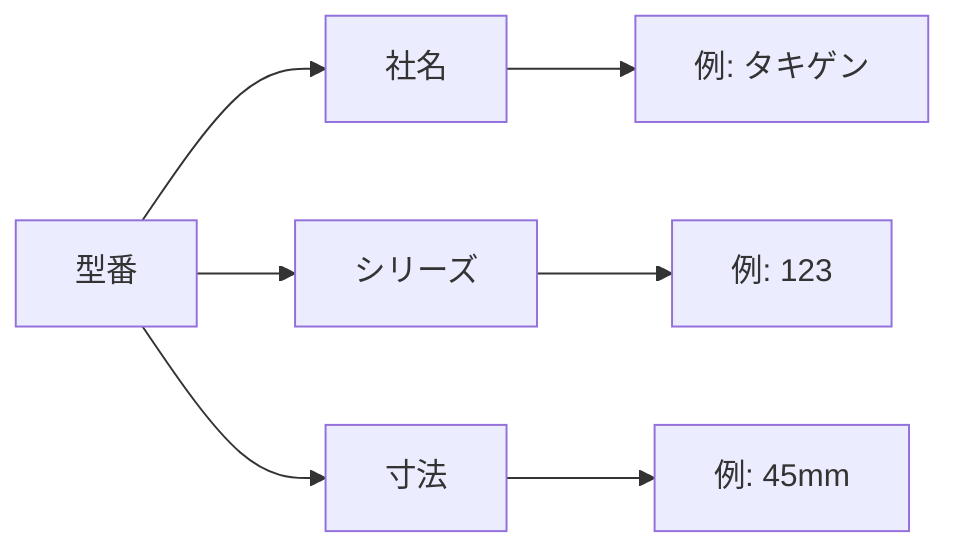

# Day 016: 型番の見方（社名・シリーズ・寸法）

産業用機構部品の型番は、製品を特定するための重要な情報です。図面が読めなくても、型番の基本的な見方を理解することで、製品の選定や発注がスムーズに行えるようになります。今日は、型番の構成要素である「社名」「シリーズ」「寸法」について学びます。

## 型番の基本構成

型番は通常、以下の3つの要素で構成されています。

1. **社名**: 製品を製造しているメーカーの名前を示します。例えば、「タキゲン」や「シブタニ」などがこれに該当します。社名は型番の最初に来ることが多く、製品の信頼性や品質を判断する手がかりとなります。

2. **シリーズ**: 同じ機能や用途を持つ製品群を表します。シリーズ名は、製品の特性や用途を示すために使われ、特定のニーズに応じた選択を容易にします。例えば、耐久性が求められる環境向けのシリーズや、軽量化されたシリーズなどがあります。

3. **寸法**: 製品の具体的なサイズを示します。寸法は、取り付け場所や使用条件に適合するかどうかを判断するために重要です。通常、ミリメートル（mm）単位で表記され、長さ、幅、高さなどの情報が含まれます。

## 型番の例

例えば、ある金具の型番が「TAK-123-45」となっている場合、以下のように解釈できます。

- **TAK**: タキゲンというメーカー名
- **123**: 特定のシリーズを示す番号
- **45**: 寸法を示す数字（例えば、45mm）

## 図で理解する

以下のフローチャートは、型番の読み方を視覚的に示しています。

## 今日のポイント
- 型番は「社名」「シリーズ」「寸法」の3つの要素で構成される
- 社名は製品の信頼性を示し、シリーズは用途や特性を示す
- 寸法は取り付け場所や使用条件に合うかを判断するために重要

## 明日へのつながり

明日は、具体的なケーススタディを通じて、型番の選定プロセスをさらに深く理解していきます。これにより、実際の業務での応用力を高めましょう。
