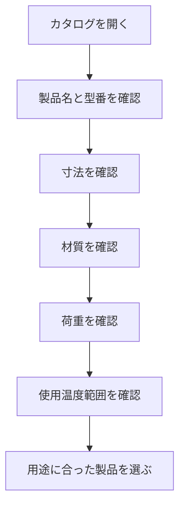

# Day 017: カタログの見方（仕様表の読み方）

産業用機構部品のカタログは、製品選びにおいて非常に重要な情報源です。しかし、図面が読めない方にとっては、仕様表の理解が難しいかもしれません。今日は、カタログの仕様表の読み方を、図面が読めなくても理解できるように解説します。

## 仕様表の基本構成

カタログの仕様表には、通常以下のような情報が含まれています。

1. **製品名と型番**: 製品の識別に使用される名前と番号です。前回学んだように、型番には社名やシリーズ、寸法が含まれることがあります。
   
2. **寸法**: 製品の大きさを示します。図面が読めない場合でも、寸法は数値で示されるため、長さや幅、高さなどを確認することができます。

3. **材質**: 製品が何で作られているかを示します。例えば、ステンレスやプラスチックなどが一般的です。材質は製品の耐久性や使用環境に影響します。

4. **荷重**: 製品が耐えられる力の大きさを示します。通常は「最大荷重」などの形で記載されます。

5. **使用温度範囲**: 製品が正常に動作する温度の範囲です。これも使用環境に大きく影響します。

## 仕様表の読み方

仕様表を読む際には、以下のポイントを押さえておくと良いでしょう。

- **用途に合った材質を選ぶ**: 環境に応じた材質を選ぶことが重要です。例えば、屋外で使用する場合は耐候性のある材質が必要です。

- **寸法を確認する**: 設置場所に合うかどうかを確認するために、寸法は必ずチェックしましょう。

- **荷重と温度範囲を確認する**: 使用条件に合った製品を選ぶために、これらの項目も重要です。

## 図で理解する

以下のフローチャートは、仕様表を読む際の基本的な流れを示しています。

## 今日のポイント
- 仕様表には製品名、型番、寸法、材質、荷重、使用温度範囲が記載されている
- 用途に応じて材質や寸法を確認することが重要
- 使用環境に適した荷重と温度範囲を選ぶ

## 明日へのつながり
次回は、実際にカタログを使って製品を選ぶ際の具体的な手順について学びます。これにより、より実践的な製品選びができるようになります。
