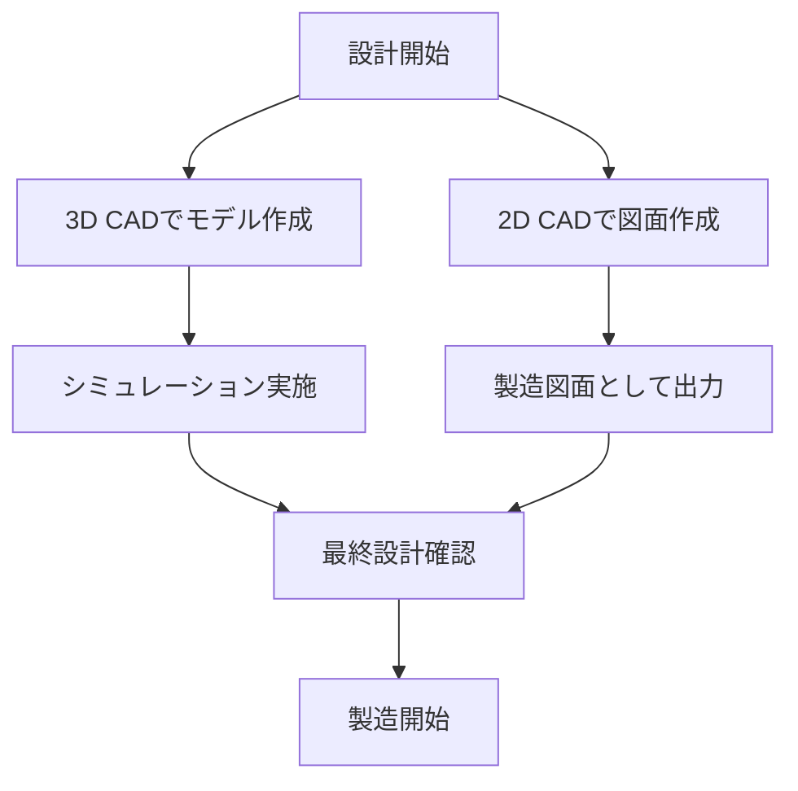

# Day 018: CADデータの種類（2D/3D）

産業用機構部品の設計や製造において、CAD（キャド：Computer-Aided Design）は欠かせないツールです。CADデータには大きく分けて2D（2次元）と3D（3次元）の2種類があります。それぞれの特徴と用途を理解することで、図面が読めなくても業界の仕組みを把握できるようになります。

## 2D CADデータ

2D CADデータは、平面上に図形を描くためのデータです。紙の図面と同じように、部品の形状や寸法を平面的に表現します。例えば、上面図や側面図、正面図などがこれに該当します。2D CADは以下のような特徴があります。

- **簡単な操作性**: 基本的な線や円を描くことが中心で、比較的簡単に習得できます。
- **軽量なデータ**: データサイズが小さく、処理速度が速いです。
- **製造図面に適している**: 部品の寸法や加工指示を明確に伝えることができます。

## 3D CADデータ

3D CADデータは、立体的なモデルを作成するためのデータです。部品を実際に手に取ったかのように、あらゆる角度から確認することができます。3D CADの特徴は以下の通りです。

- **立体的な表現**: 部品の形状を直感的に理解できます。
- **シミュレーションが可能**: 組み立てや動作のシミュレーションを行うことができます。
- **設計の自由度が高い**: 複雑な形状やアセンブリ（組み立て）を効率的に設計できます。

## 図で理解する

以下の図は、2D CADと3D CADのデータフローを簡単に示したものです。

## 今日のポイント
- **2D CAD**は平面的な図面を作成し、製造指示に適しています。
- **3D CAD**は立体的なモデルを作成し、設計やシミュレーションに適しています。
- CADデータの種類を理解することで、設計から製造までの流れを把握しやすくなります。

## 明日へのつながり
明日は、2Dと3D CADの具体的な操作方法や、業界での活用事例について学びます。これにより、CADの実用的な使い方をさらに深めていきましょう。
