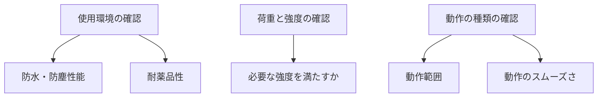

# Day 019: 選定で最初に見る項目

産業用機構部品を選定する際に、最初に確認すべき項目は何でしょうか。図面が読めない方でも理解できるように、今回は部品選定で重要な基本的なポイントを解説します。これらのポイントを押さえることで、適切な部品を選びやすくなります。

## 1. 使用環境

まず考慮すべきは、部品が使用される環境です。例えば、屋外で使用する場合は防水・防塵性能が求められます。また、化学薬品を扱う環境では耐薬品性が重要です。このように、使用環境に応じた特性を持つ部品を選ぶことが必要です。

## 2. 荷重と強度

次に確認するのは、部品がどれくらいの荷重（力）に耐えられるかです。例えば、重い扉を支えるヒンジ（蝶番）には高い強度が求められます。荷重に対する強度が不足していると、部品が破損するリスクがあります。

## 3. 動作の種類

部品がどのように動作するかも重要なポイントです。例えば、スライドレールは引き出しをスムーズに動かすために使用されますが、その動きの範囲やスムーズさが用途に合っているか確認が必要です。動作が適切でないと、機械全体の性能に影響を与える可能性があります。

## 図で理解する

以下のフローチャートは、部品選定の際に確認すべき項目を示しています。

## 今日のポイント
- 使用環境に応じた特性を持つ部品を選ぶ
- 荷重に対する適切な強度を確認する
- 部品の動作が用途に合っているか確認する

## 明日へのつながり
明日は、これらの選定項目を具体的にどう判断するか、実際の製品例を通じて理解を深めます。
