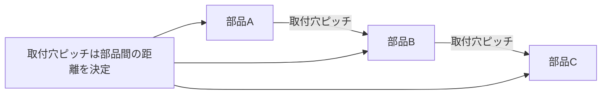

# Day 020: 取付穴ピッチの基礎

産業用機構部品を取り付ける際、最も重要な要素の一つが「取付穴ピッチ」です。取付穴ピッチとは、部品を固定するための穴と穴の間の距離を指します。これを正確に理解することは、部品をしっかりと取り付け、機械や装置が正しく機能するために不可欠です。

## 取付穴ピッチの役割

取付穴ピッチは、部品を取り付ける際の位置決めに重要な役割を果たします。例えば、ドアのヒンジや機械のカバーを取り付ける際に、穴の位置がずれていると、部品が正しく取り付けられず、機能不全を起こす可能性があります。取付穴ピッチが正確であることで、部品同士が適切に連結され、全体としての機能を発揮します。

## 取付穴ピッチの測定方法

取付穴ピッチは通常、図面上で寸法として示されますが、図面が読めなくても、以下のような方法で理解できます。

1. **直接測定**: 実際の部品を手に取り、穴の中心から中心までの距離を定規やノギスで測定します。
2. **カタログ参照**: メーカーのカタログには、取付穴ピッチが明記されています。これを確認することで、図面を読まずに寸法を把握できます。

## 図で理解する

以下の図は、取付穴ピッチの概念を視覚的に示したものです。

## 今日のポイント
- **取付穴ピッチの定義**: 穴と穴の間の距離で、部品の正確な取り付けに不可欠。
- **測定方法**: 直接測定やカタログ参照で確認可能。
- **役割の重要性**: 機械や装置の機能を確保するために重要。

## 明日へのつながり

明日は、取付穴ピッチを実際の業務でどのように活用するかについて学びます。具体的な事例を通して、さらに理解を深めていきましょう。
