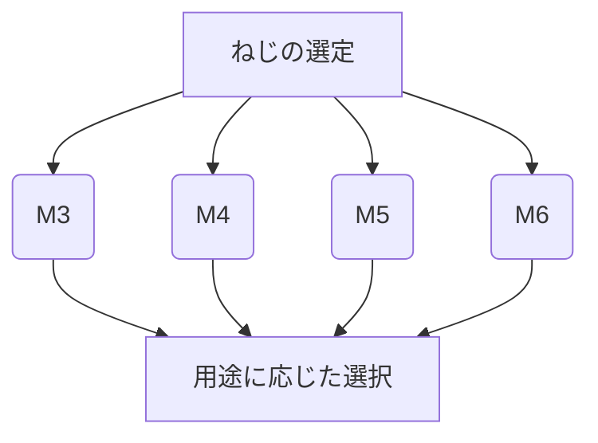

# Day 021: ねじ規格の基礎（M3/M4/M5/M6）

ねじは、産業用機構部品の中で非常に重要な役割を果たします。ねじを使うことで、部品同士をしっかりと固定したり、調整したりすることができます。今回は、特にM3、M4、M5、M6といった一般的なねじ規格について学びます。

## ねじの基本

ねじは、円筒形の軸に螺旋状の溝が刻まれた部品で、主に部品を締結するために使われます。「M3」や「M4」といった表記は、ねじの直径を示しています。具体的には、M3は直径3mm、M4は直径4mmという意味です。この直径は、ねじが通る穴の大きさや、ねじが固定する部品の厚さに影響します。

## ねじの役割

ねじの役割は大きく分けて二つあります。一つは、部品をしっかりと固定すること。もう一つは、部品の位置を調整することです。例えば、機械のカバーを固定するのにねじを使うと、簡単に取り外しができ、メンテナンスがしやすくなります。

## ねじの種類

ねじには多くの種類がありますが、ここでは代表的なものを紹介します。

- **六角ボルト**: 頭が六角形になっており、レンチで回すことができます。
- **皿ねじ**: 頭が平らで、表面に出ないように取り付けることができます。
- **タッピングねじ**: 下穴を開けずに直接ねじ込むことができるねじです。

これらのねじは、用途や取り付ける部品の材質によって使い分けられます。

## 図で理解する

## 今日のポイント
- **ねじの直径**: M3、M4、M5、M6はそれぞれ直径3mm、4mm、5mm、6mmを示す。
- **ねじの役割**: 固定と調整の二つの重要な役割を持つ。
- **ねじの種類**: 用途に応じて六角ボルト、皿ねじ、タッピングねじなどがある。

## 明日へのつながり
明日は、ねじの素材や表面処理について学び、どのように選定するかを理解します。これにより、より適切なねじ選びができるようになります。
