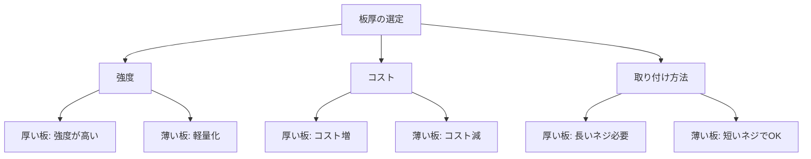

# Day 022: 板厚と選定の関係

産業用機構部品の選定において、「板厚」は非常に重要な要素です。板厚とは、部品を構成する金属やプラスチックの板の厚さを指し、部品の強度や耐久性に直結します。異業種から転職してきた方にとっては、図面を読むことが難しいかもしれませんが、板厚の基本的な概念を理解することで、選定の際に役立つ知識を得ることができます。

まず、板厚が厚いほど、一般に強度が増します。これは、板が外部からの力を受けたときに変形しにくくなるためです。例えば、重い扉を支えるためのヒンジ（蝶番）には、厚い板が使われることが多いです。一方で、板厚が薄いと軽量化が図れるため、持ち運びやすさが求められる製品に適しています。

次に、板厚は製造コストにも影響を与えます。厚い板は材料が多く必要になるため、コストが高くなる傾向があります。そのため、必要な強度を満たしつつ、コストを抑えるために適切な板厚を選定することが求められます。

また、板厚は取り付け方法にも影響します。例えば、ネジで固定する場合、板が薄すぎるとネジがしっかりと固定できないことがあります。逆に、板が厚すぎると、ネジが届かないこともあります。このため、板厚に応じた適切な取り付け方法を選ぶことが重要です。

以下の図は、板厚と選定の関係を簡単に示したものです。

## 図で理解する

## 今日のポイント
- 板厚は部品の強度や耐久性に影響する
- 板厚は製造コストに直結し、適切な選定が必要
- 板厚に応じた取り付け方法を選ぶことが重要

## 明日へのつながり
明日は、板厚に関連する具体的な取り付け方法について詳しく学び、実際の選定に役立つ知識を深めていきます。
