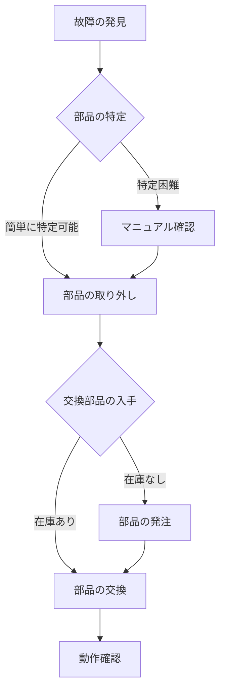

# Day 023: メンテナンス性の考え方

メンテナンス性とは、機械や設備がどれだけ容易に保守や修理ができるかを示す考え方です。産業用機構部品を扱う際、メンテナンス性は非常に重要な要素です。なぜなら、機械が故障した際に迅速に修理できるかどうかが、生産効率やコストに大きく影響するからです。

## メンテナンス性の基本要素

1. **アクセスのしやすさ**: 部品が簡単に取り外せるか、または交換できるかが重要です。例えば、タキゲンやスガツネのようなメーカーの製品では、工具を使わずに開閉できるパネルや、簡単に取り外せるヒンジが開発されています。

2. **部品の共通化**: 同じ種類の部品を様々な機械で使うことで、交換部品の管理が容易になります。シブタニや栃木屋の製品では、共通のねじ規格や取り付け方法を採用することで、メンテナンスの効率が向上しています。

3. **情報の明確化**: 図面が読めなくても、どの部品がどこにあるのか、どのように交換するのかが分かるようにすることが大切です。これには、マニュアルやラベルの整備が含まれます。

## 図で理解する

以下のフローチャートは、メンテナンス性を考慮した部品交換の流れを示しています。

## 今日のポイント
- メンテナンス性は、機械の保守や修理のしやすさを示す重要な要素です。
- アクセスのしやすさ、部品の共通化、情報の明確化がメンテナンス性を高めます。
- メンテナンス性を考慮した設計は、生産効率やコスト削減に直結します。

## 明日へのつながり
明日は、メンテナンス性をさらに高めるための具体的な設計手法について学びます。これにより、より効率的な機械設計が可能になります。
