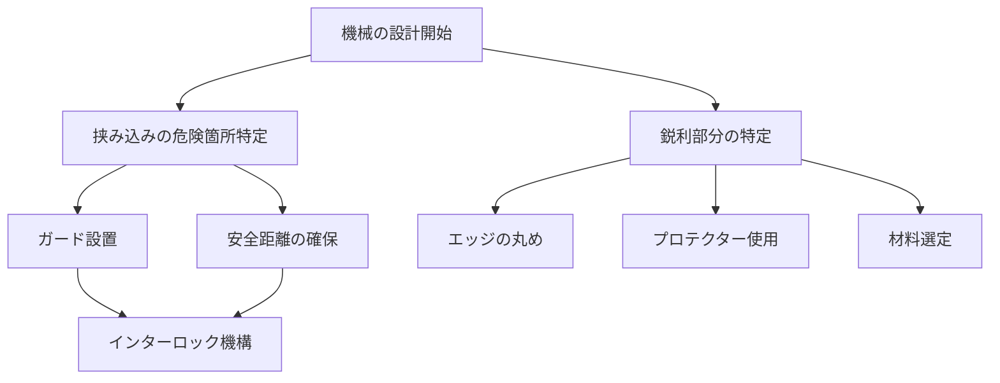

# Day 024: 安全設計の基礎（挟み・鋭利）

産業用機構部品の設計において、安全性は非常に重要な要素です。特に、挟み込みや鋭利な部分に関する安全設計は、作業者の怪我を防ぐために欠かせません。今日は、これらの安全設計の基本を学びましょう。

## 挟み込みの防止

機械や装置には、動く部品が多く存在します。これらの部品が動く際に、作業者の手や指が挟まれる危険があります。挟み込みを防ぐための設計には、以下のような方法があります。

1. **ガードの設置**: 動く部分を覆うカバーやガードを設置し、物理的に接触を防ぎます。
2. **安全距離の確保**: 部品間の距離を十分に取り、手が届かないようにします。
3. **インターロック機構**: カバーが開いているときには機械が動かないようにする仕組みです。

## 鋭利な部分の処理

鋭利なエッジや角は、作業者の怪我の原因となります。これを防ぐためには、以下のような対策が取られます。

1. **エッジの丸め**: 鋭利なエッジを丸く加工し、接触時の危険を軽減します。
2. **プロテクターの使用**: 鋭利な部分を覆うことで、直接触れることを防ぎます。
3. **材料選定**: 柔らかい素材を用いることで、鋭利さを軽減します。

## 図で理解する

以下のフローチャートは、挟み込み防止と鋭利部分の安全対策の流れを示しています。

## 今日のポイント
- 挟み込みを防ぐためには、ガードやインターロック機構が重要。
- 鋭利な部分は、エッジを丸めたりプロテクターを使って安全性を確保。
- 安全設計は、作業者の怪我を未然に防ぐための基本的な対策。

## 明日へのつながり
明日は、これらの安全設計を実際の製品選定にどう活かすかを学びます。安全性を考慮した製品選びのポイントを押さえましょう。
