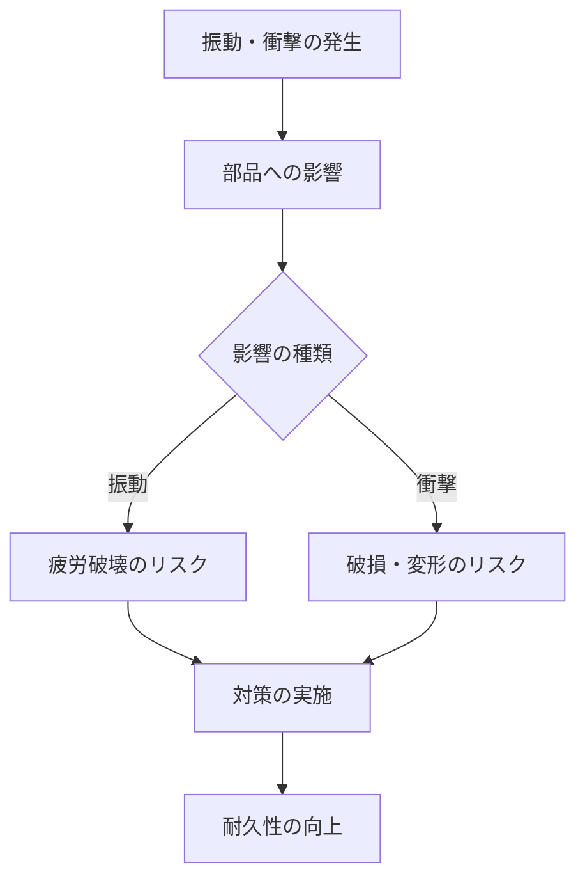

# Day 025: 振動・衝撃環境の考え方

振動や衝撃は、産業用機構部品が使用される環境において重要な要素です。これらの力は、機械や装置の性能や耐久性に大きな影響を与えるため、設計段階でしっかりと考慮する必要があります。

## 振動とは何か？

振動とは、物体が一定の周期で揺れ動く現象のことです。例えば、モーターが動くときに発生する微細な揺れや、車が走行中に感じる道路からの揺れがこれに該当します。振動は、長時間にわたって部品にストレスを与え、疲労破壊（材料が繰り返しの応力で破壊されること）を引き起こす可能性があります。

## 衝撃とは何か？

衝撃は、短時間に大きな力が加わる現象です。例えば、物が落下したときや、機械が急停止したときに発生します。衝撃は、瞬間的に大きな負荷がかかるため、部品の破損や変形を引き起こすことがあります。

## 振動・衝撃に対する対策

振動や衝撃に対する対策としては、以下のような方法があります。

1. **緩衝材の使用**: ゴムやバネなどの緩衝材を使用して、振動や衝撃を吸収します。
2. **構造の強化**: 部品の形状や材質を工夫して、振動や衝撃に強い構造にします。
3. **適切な固定方法**: 部品をしっかりと固定し、不要な動きを防ぎます。

これらの対策を組み合わせることで、機械や装置の耐久性を高めることができます。

## 図で理解する

以下のフローチャートは、振動や衝撃がどのように機械に影響を与えるかを示しています。

## 今日のポイント
- 振動は周期的な動きで、長期間のストレスを部品に与える。
- 衝撃は瞬間的な力で、部品の破損や変形を引き起こす。
- 緩衝材の使用や構造の強化で、振動・衝撃に対処する。

## 明日へのつながり
明日は、振動・衝撃対策の具体的な製品選定方法について学びます。これにより、実際の業務での応用が可能になります。
