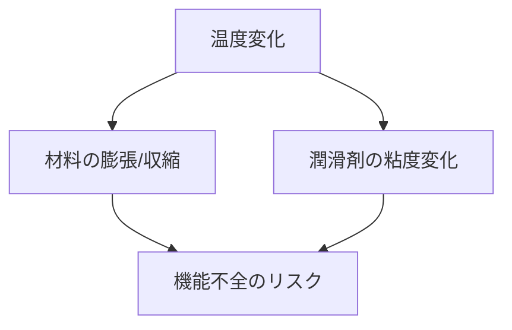

# Day 026: 温度環境の考え方

産業用機構部品を扱う際、温度環境は非常に重要な要素です。部品が使用される環境の温度が適切でないと、機能不全や破損を引き起こす可能性があります。今日は、温度環境がどのように機構部品に影響を与えるのか、その基本的な考え方を学びます。

## 温度の影響と材料の特性

まず、温度が部品に与える影響を理解するためには、材料の特性を知ることが重要です。多くの部品は金属やプラスチックで作られていますが、これらの材料は温度によって膨張や収縮します。例えば、金属は温度が上がると膨張し、下がると収縮します。この性質を考慮しないと、部品が適切に機能しなくなることがあります。

## 温度範囲と使用環境

部品を選定する際には、その部品が耐えられる温度範囲を確認する必要があります。例えば、屋外で使用される部品は、夏の高温や冬の低温に耐えなければなりません。また、工場内で使用される部品も、機械や設備から発生する熱に耐える必要があります。各メーカーは、部品の仕様書に推奨される温度範囲を記載しているので、これを参考に選定します。

## 温度と潤滑

温度は潤滑にも影響を与えます。潤滑剤は、温度が高すぎると粘度が低下し、低すぎると固化することがあります。適切な潤滑を維持するためには、使用環境の温度に応じた潤滑剤を選ぶことが重要です。これにより、部品の摩耗を防ぎ、寿命を延ばすことができます。

## 図で理解する

以下の図は、温度が部品に与える影響を示しています。温度変化が部品の寸法や潤滑にどのように影響するかを視覚的に理解しましょう。

## 今日のポイント
- 温度環境は部品の膨張や収縮に影響を与える
- 部品の選定時には使用環境の温度範囲を考慮する
- 適切な潤滑剤を選ぶことで部品の寿命を延ばせる

## 明日へのつながり
明日は、温度環境に関連する「湿度環境の考え方」を学びます。温度と湿度は密接に関係しており、部品の選定やメンテナンスにおいて重要な要素です。
