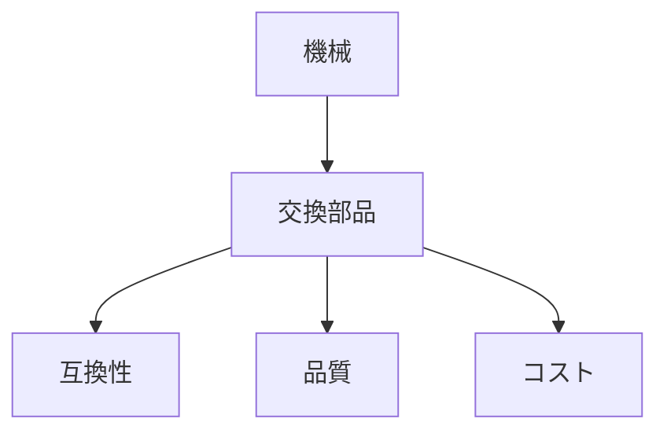

# Day 027: 交換部品の考え方

産業用機械の運用において、交換部品は非常に重要な役割を果たします。交換部品とは、機械が正常に動作し続けるために、定期的に交換が必要な部品のことです。これらは、機械の信頼性や寿命を延ばすために不可欠です。

交換部品には、摩耗や劣化が避けられない部品が含まれます。例えば、ベアリングやシール、フィルターなどが挙げられます。これらの部品は、機械の動きや環境条件により時間とともに劣化します。そのため、定期的な点検と交換が必要です。

交換部品を選ぶ際には、いくつかのポイントがあります。まず、互換性です。機械の設計に合った部品を選ばなければ、性能が低下したり、故障の原因となります。次に、品質です。信頼できるメーカーの部品を選ぶことで、機械のパフォーマンスを維持できます。最後に、コストです。安価な部品を選ぶと、短期間で再交換が必要になることがあるため、長期的な視点でコストを考えることが重要です。

交換部品の管理には、在庫管理も含まれます。必要な部品を適切にストックしておくことで、故障時のダウンタイムを最小限に抑えることができます。さらに、予防保全の一環として、部品の交換スケジュールを立てることも重要です。これにより、予期せぬトラブルを防ぎ、機械の稼働率を向上させることができます。

## 図で理解する

## 今日のポイント
- 交換部品は機械の信頼性を保つ
- 互換性・品質・コストを考慮
- 適切な在庫管理でダウンタイム削減

## 明日へのつながり
明日は、交換部品の具体的な選定方法について詳しく学び、実際の運用に役立てる方法を探ります。
