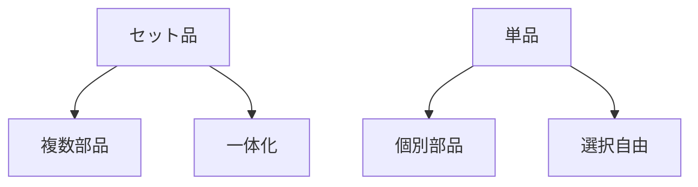

# Day 028: セット品と単品の違い

産業用機構部品の世界では、「セット品」と「単品」という用語が頻繁に使われます。この2つの違いを理解することは、部品の選定や管理において非常に重要です。今回は、図面が読めない方でもわかるように、セット品と単品の基本的な違いを解説します。

## セット品とは？

セット品は、複数の部品が一体となって提供される製品です。例えば、ドアの取っ手とその取り付けネジが一緒になっている場合、これをセット品と呼びます。セット品の利点は、必要な部品がすべて揃っているため、組み立てが簡単で、部品を個別に調達する手間が省けることです。また、互換性の問題も少なく、品質が安定しやすいというメリットがあります。

## 単品とは？

一方、単品は個別に提供される部品のことを指します。例えば、取っ手のみやネジのみを別々に購入する場合です。単品の利点は、特定の部品だけを交換したい場合や、既存のシステムに合わせて部品を選びたい場合に柔軟に対応できることです。また、特定の部品が故障した際にその部分だけを交換できるため、コストを抑えることが可能です。

## セット品と単品の選び方

セット品と単品のどちらを選ぶかは、用途や状況によって異なります。新規にシステムを構築する場合や、標準化された組立を行う場合はセット品が便利です。逆に、既存のシステムに追加や交換を行う場合は、単品の方が適していることが多いです。

## 図で理解する

## 今日のポイント
- セット品は複数部品が一体化
- 単品は個別部品で選択自由
- 用途に応じて選択が重要

## 明日へのつながり
明日は、具体的な部品の選び方について詳しく学びます。セット品と単品の知識を活かして、効率的な部品管理を目指しましょう。
