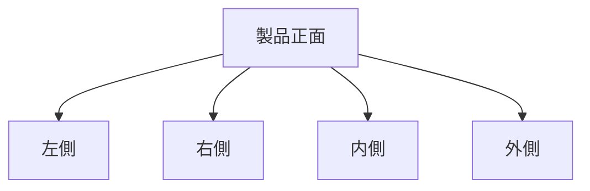

# Day 029: 左右・内外の表記

産業用機構部品の図面を読み解く際に重要な要素の一つが「左右・内外の表記」です。これらの表記は、部品の取り付け方向や位置関係を正確に伝えるために使用されます。特に、製品の設計や組み立てにおいて、誤解を避けるために非常に重要です。

## 左右の表記

左右の表記は、部品の取り付け方向を示すために用いられます。一般的に、製品を正面から見たときの視点で「左」と「右」が決まります。この視点は、製品の使用者がどの方向から製品を操作するかを基準にしています。例えば、ドアのヒンジやハンドルの取り付け位置を示す際に、左右の表記が重要となります。

## 内外の表記

内外の表記は、部品が製品のどの位置にあるかを示します。「内」は製品の中心に近い位置を、「外」は製品の外側に近い位置を指します。この表記は、特に複雑な構造を持つ製品において、部品の取り付け位置を明確にするために使用されます。例えば、キャビネットの引き出しレールの取り付け位置を示す際に内外の表記が用いられます。

## 図で理解する

## 今日のポイント
- 左右の表記は製品を正面から見た視点で決まる
- 内外の表記は製品の中心からの距離を示す
- 正確な表記は誤解を防ぎ、組み立ての効率を向上させる

## 明日へのつながり
明日は、これらの表記がどのように実際の製品設計に影響を与えるかを、具体的な事例を通じて学びます。
