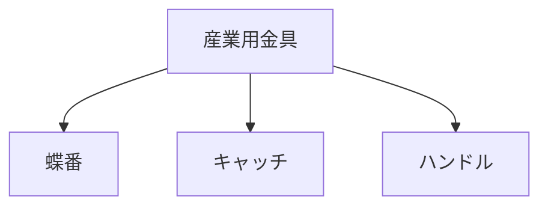

# Day 030: 今日までの基礎まとめ

これまでの学習を振り返り、産業用金具の基礎を総まとめします。図面が読めない方でも、部品の役割や使われ方を理解することが重要です。以下に、これまでの主要なポイントを整理します。

## 産業用金具の基本

産業用金具とは、機械や装置の構造を支えるための部品です。これには、蝶番（ちょうつがい）、キャッチ、ハンドルなどが含まれます。これらの部品は、機械の動きをスムーズにし、安定した運用を支える重要な役割を果たします。

### 1. 蝶番（ちょうつがい）

蝶番は、扉や蓋を開閉するための部品です。これにより、機械の内部にアクセスしやすくなります。蝶番の選択は、使用環境や負荷に応じて行われます。

### 2. キャッチ

キャッチは、扉や蓋を閉じた状態で固定するための部品です。これにより、機械の安全性が高まります。キャッチには様々な種類があり、用途に応じて選択されます。

### 3. ハンドル

ハンドルは、機械や装置を操作するための取っ手です。操作性を向上させるために、人間工学に基づいたデザインが採用されています。

## 図で理解する

以下の図は、産業用金具の基本的な構成を示しています。

## 今日のポイント
- 産業用金具は機械の動きを支える
- 蝶番は開閉をサポート
- キャッチは安全性を確保

## 明日へのつながり
明日は、これまでの基礎を踏まえて、より高度な機構部品の理解に進みます。具体的な応用例を通じて、実践的な知識を深めましょう。
