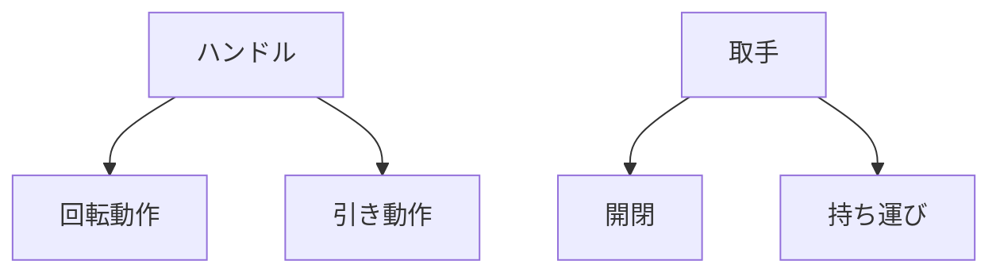

# Day 031: ハンドルと取手の違い

ハンドルと取手は、どちらも物を操作するための部品ですが、その役割や使われ方には違いがあります。これらは、日常生活や産業用機器において重要な役割を果たしています。ここでは、図面が読めない方でも理解できるように、ハンドルと取手の違いを説明します。

## ハンドルとは

ハンドルは、主に回転や引き動作を行うための部品です。例えば、ドアノブやバルブの操作に使われることが多く、手で握って回すことで機械や装置を動かす役割を持ちます。ハンドルは、力を効率的に伝えるために設計されており、長さや形状が用途に応じて様々です。

## 取手とは

取手は、主に開閉や持ち運びのための部品です。例えば、引き出しやキャビネットの扉を開けるために使われます。取手は、指や手で引っ掛けて使うことが多く、形状はシンプルで、操作するための力を直接的に伝える構造になっています。

## ハンドルと取手の違い

1. **動作の違い**: ハンドルは回転や引き動作を行うのに対し、取手は引っ張る動作が主です。
2. **用途の違い**: ハンドルは機械の操作に使われ、取手は主に扉や引き出しの開閉に使われます。
3. **設計の違い**: ハンドルは力を伝えるために長さや形状が工夫されており、取手はシンプルな形状が多いです。

## 図で理解する

## 今日のポイント
- ハンドルは回転や引き動作を行う部品
- 取手は開閉や持ち運びに使う部品
- 用途に応じて設計が異なる

## 明日へのつながり
次回は、つまみの役割とその使い方について学びます。つまみは、小さな力で精密な操作を可能にする部品です。
