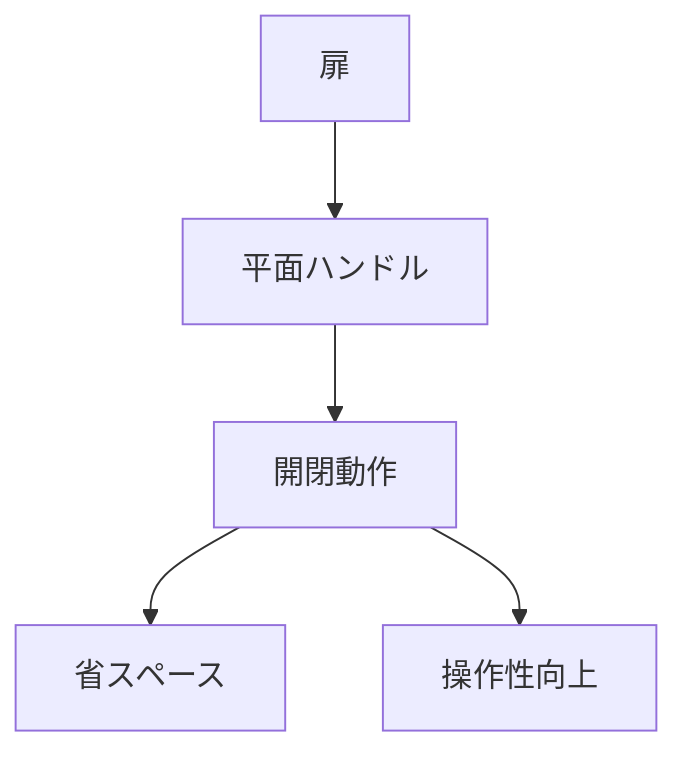

# Day 032: 平面ハンドルとは

平面ハンドルは、主に扉や蓋の開閉をサポートするための部品です。一般的に、平面ハンドルはその名の通り、取り付け面とほぼ同じ平面上に設置されることが特徴です。これにより、限られたスペースでも使用しやすく、見た目もすっきりとしたデザインが可能です。

## 平面ハンドルの特徴

1. **省スペース設計**: 平面ハンドルは、扉や蓋の表面に対して突出が少ないため、狭い場所や多くの部品が集まる場所でも邪魔になりません。例えば、機械の内部や家具の引き出しなど、スペースが限られている場所で重宝されます。

2. **操作のしやすさ**: 平面ハンドルは、手で簡単に掴むことができるように設計されています。これにより、頻繁に開閉する必要がある扉や蓋に最適です。多くの場合、ハンドル部分が持ち上がるか、回転することで操作が完了します。

3. **デザイン性**: 平面ハンドルは、見た目がシンプルであるため、機械や家具のデザインを損なわずに取り付けることができます。特に、現代的なデザインの家具や機械においては、平面ハンドルが好まれる傾向にあります。

## 平面ハンドルの用途

平面ハンドルは、工業用機械や家具、電化製品など、さまざまな分野で使用されています。例えば、電気制御盤の扉や、オフィス家具の引き出し、キッチンキャビネットの扉などに取り付けられています。これらの用途では、操作のしやすさとデザイン性が特に重視されます。

## 図で理解する

## 今日のポイント
- 平面ハンドルは省スペース設計
- 操作が簡単で頻繁な開閉に最適
- シンプルなデザインで多用途

## 明日へのつながり
明日は、ハンドルや取手の取り付け方法について学び、具体的な取り付け例を通じて理解を深めます。
