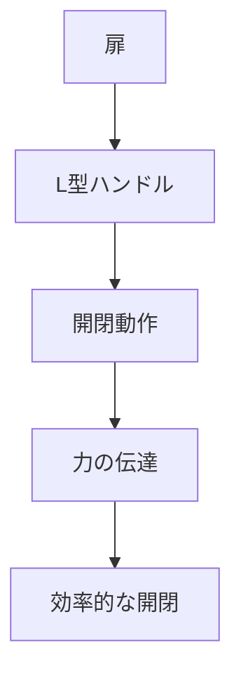

# Day 033: L型ハンドルとは

L型ハンドルは、その名の通りL字型の形状を持つハンドルです。主に扉や蓋の開閉に用いられ、使いやすさとデザイン性の両方を兼ね備えています。L型ハンドルは、垂直部分と水平部分の2つのセクションから構成され、これにより握りやすく、力をかけやすい設計となっています。

## L型ハンドルの特徴

### 1. 形状と機能
L型ハンドルの最大の特徴は、その形状にあります。L字型のデザインは、手でしっかりと握ることができ、開閉時に力を効率的に伝えることができます。この形状は、特に重い扉や頻繁に開閉する蓋に適しています。

### 2. 素材と仕上げ
L型ハンドルは、金属やプラスチックなど様々な素材で作られています。金属製のものは耐久性が高く、工業用機械や大型設備に多く使用されます。一方、プラスチック製のものは軽量で、家庭用や小型の機器に適しています。また、表面の仕上げも多様で、錆びにくい加工や滑りにくい加工が施されていることが一般的です。

### 3. 取り付け方法
L型ハンドルは、通常、ネジやボルトでしっかりと固定されます。取り付けは比較的簡単で、必要な工具があれば誰でも行うことができます。取り付ける際には、ハンドルが扉や蓋の動きに対して適切な位置にあることを確認することが重要です。

## 図で理解する

## 今日のポイント
- L型ハンドルはL字型で握りやすい
- 金属やプラスチックなど多様な素材で作られる
- 取り付けはネジやボルトで簡単に行える

## 明日へのつながり
明日は、L型ハンドルの取り付け方法とその注意点について詳しく学びます。これにより、実際の取り付け作業をスムーズに行えるようになります。
