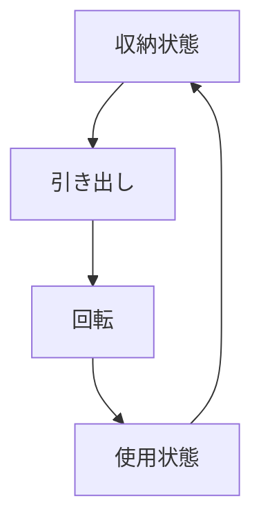

# Day 034: 収納型（スイング）ハンドル

収納型（スイング）ハンドルは、主に産業用機械や設備の扉に取り付けられる部品です。このハンドルは、使用しないときには本体に収納され、必要なときに引き出して使うことができます。これにより、機械の外観をすっきりさせるとともに、突起物による事故を防ぐことができます。

## 収納型（スイング）ハンドルの仕組み

このハンドルは、通常、本体に対して90度の角度で収納されています。使用時には、ハンドルを引き出し、180度回転させて使用します。これにより、ハンドルをしっかりと握ることができ、扉を開閉しやすくなります。

### 使用例

1. **安全性の向上**: 収納型ハンドルは、突起物がないため、作業中に衣服や体が引っかかるリスクを減少させます。
2. **デザイン性の向上**: 機械や設備の外観をすっきりとさせ、美観を保ちます。
3. **省スペース**: ハンドルが収納されるため、狭いスペースでも邪魔になりません。

## 図で理解する

## 今日のポイント
- 収納型ハンドルは安全性を高める
- デザイン性を向上させる
- 省スペースで効率的

## 明日へのつながり
明日は、ハンドルの中でも特にデザイン性が重視される「デザインハンドル」について学びます。
