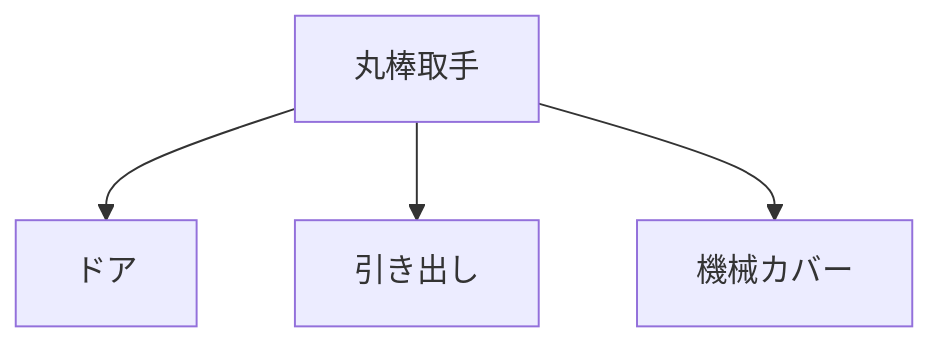

# Day 035: 丸棒取手の用途

丸棒取手は、日常生活や産業現場で広く使用される基本的な取手の一種です。丸い棒状の形状をしており、ドアや引き出し、機械のカバーなどを開閉する際に用いられます。今回は、丸棒取手の用途について詳しく見ていきましょう。

## 丸棒取手の基本構造

丸棒取手は、その名の通り、円筒形の棒を持つ取手です。通常、金属やプラスチックで作られており、強度と耐久性が求められる場面で使用されます。取手の両端は、取り付ける対象に固定されるように設計されています。

### 主な用途

1. **ドアの開閉**  
   丸棒取手は、特にドアの開閉に頻繁に使用されます。シンプルな形状で手に馴染みやすく、力を入れやすいのが特徴です。オフィスや工場のドアに取り付けられることが多いです。

2. **引き出しの操作**  
   家具や収納ユニットの引き出しにも丸棒取手が使われます。引き出しを引く動作がスムーズに行えるため、家庭用から業務用まで幅広く採用されています。

3. **機械カバーの取り扱い**  
   機械の安全カバーや点検口の開閉にも丸棒取手が利用されます。これにより、作業者が簡単にカバーを取り外したり取り付けたりすることができます。

## 丸棒取手の選び方

丸棒取手を選ぶ際には、使用する環境や目的に応じて素材やサイズを考慮することが重要です。例えば、屋外で使用する場合は、耐腐食性の高いステンレス製が適しています。また、手がかりのしやすさやデザインも選定のポイントとなります。

## 図で理解する

## 今日のポイント
- 丸棒取手はドアや引き出しに使用
- 環境に応じた素材選びが重要
- シンプルで汎用性が高い

## 明日へのつながり
明日は、丸棒取手の取り付け方法について詳しく解説します。取り付けの際に注意すべきポイントを学びましょう。
