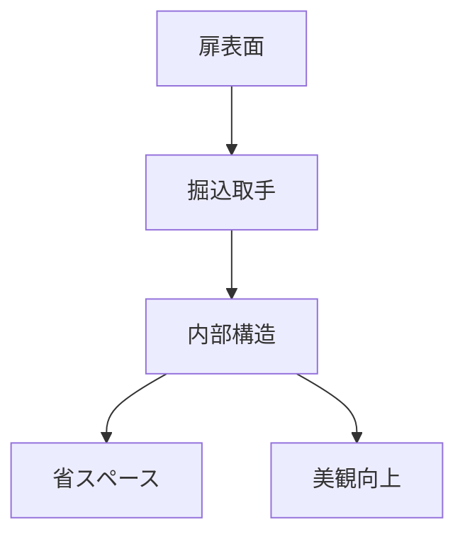

# Day 036: 掘込取手の用途

掘込取手は、扉や引き出しの表面に埋め込まれる形状の取手です。この設計により、取手が突出せず、表面がフラットに保たれます。主に限られたスペースを有効に使いたい場合や、見た目をすっきりさせたい場合に利用されます。

## 掘込取手の仕組み

掘込取手は、取手自体が扉や引き出しの内部に埋め込まれる形で取り付けられます。これにより、取手が飛び出さず、表面が平らになります。取り付けは、扉や引き出しの表面に適切なサイズの穴を開け、そこに取手をはめ込む形で行います。この構造により、取手が邪魔にならず、スペースを節約できます。

## 掘込取手の用途

掘込取手は、主に以下のような用途で使用されます。

1. **省スペース設計**: スペースが限られた場所での使用に適しています。例えば、狭い通路や小型の家具で、取手が突出していると邪魔になる場合に有効です。

2. **美観の向上**: フラットな表面を保つことで、家具や設備の外観をすっきりと見せることができます。特に、ミニマルデザインを重視するインテリアにおいては、掘込取手が好まれます。

3. **安全性の向上**: 取手が突出していないため、ぶつかることによる怪我のリスクを減らすことができます。特に、小さな子供がいる環境では安全面での利点があります。

## 図で理解する

## 今日のポイント
- 掘込取手は省スペースに最適
- 美観を保つために使われる
- 安全性も向上する利点がある

## 明日へのつながり
次回は、特殊な形状を持つ「つまみ」の種類とその用途について学びます。掘込取手との違いを理解することで、より多様なデザイン選択が可能になります。
