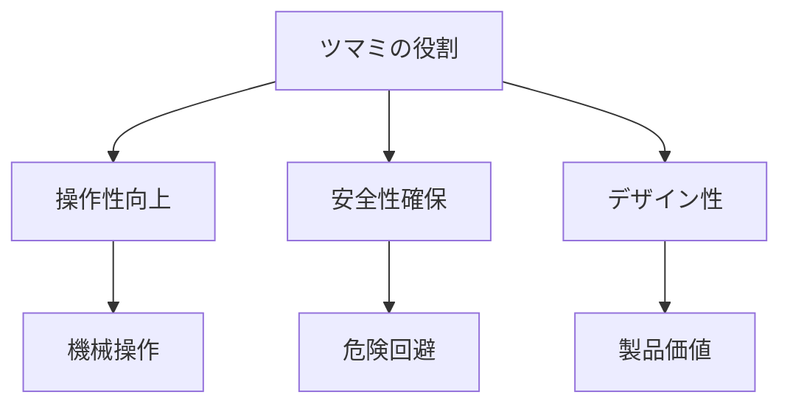

# Day 037: ツマミ（ノブ）の用途

ツマミ（ノブ）は、機械や家具の一部として、手で回したり引いたりして操作するための部品です。日常生活でもよく目にするこの部品ですが、産業用としては特に重要な役割を果たしています。今回は、ツマミの用途について詳しく見ていきましょう。

## ツマミの基本的な役割

ツマミは、主に以下のような用途で使用されます。

1. **操作性の向上**: ツマミは、機械や装置の操作を容易にするために設計されています。例えば、機械の設定を調整する際に、ツマミを回すことで簡単に微調整が可能です。

2. **安全性の確保**: ツマミを使用することで、直接手で触れることが難しい場所や、危険な状況を避けることができます。これにより、操作する人の安全を守ります。

3. **デザイン性の向上**: ツマミは、製品のデザインにおいても重要な要素です。見た目の美しさや使いやすさを考慮して選ばれることが多く、製品全体の価値を高めます。

## 具体的な用途例

ツマミは、さまざまな場面で使用されています。以下にいくつかの具体例を挙げます。

- **機械の操作パネル**: 工場の機械や設備の操作パネルには、設定を調整するためのツマミが多く使用されています。これにより、操作員は簡単に機械の動作を制御できます。

- **家具の引き出し**: 家具の引き出しや扉に取り付けられたツマミは、開閉をスムーズに行うためのものです。デザイン性も考慮され、インテリアの一部としても機能します。

- **電子機器**: ラジオやオーディオ機器などの電子機器には、音量調整やチューニングのためのツマミが付いています。これにより、ユーザーは直感的に操作できるようになっています。

## 図で理解する

## 今日のポイント
- ツマミは操作性を高める重要な部品
- 安全性を確保する役割も持つ
- デザイン性で製品価値を向上

## 明日へのつながり
明日は、ツマミの選び方について詳しく学びます。用途に応じた適切な選択が製品の性能を左右します。
