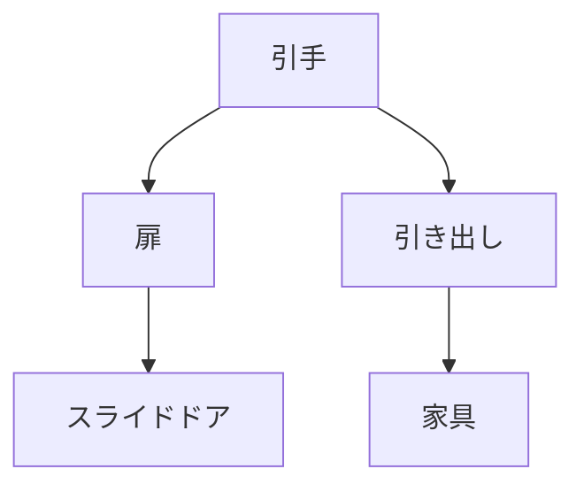

# Day 038: 引手の用途

引手は、扉や引き出しを開閉するために取り付けられる部品です。これらは家具や建具の一部として、日常生活や産業現場で広く使われています。引手の役割は単純に見えますが、使いやすさやデザイン性が求められるため、選び方にはポイントがあります。

まず、引手の基本的な役割は、扉や引き出しを開けたり閉めたりする際に、手をかけて力を加えるための取手として機能することです。このため、引手の形状や取り付け位置が使いやすさに直結します。例えば、引手が手の届く位置にないと、開閉が不便になります。また、滑りにくい素材や形状が選ばれることで、より安全に使用できます。

次に、引手のデザインは、家具や建具の全体的な見た目に大きく影響します。シンプルなデザインの引手は、モダンなインテリアに適していますし、装飾的な引手はクラシックな雰囲気を演出します。ここで重要なのは、引手が他の部品や家具全体と調和することです。

さらに、引手には特定の用途に応じた種類があります。例えば、スライドドア用の引手は、扉が横に動くため、引手自体が扉の平面に埋め込まれていることが多いです。これにより、扉の開閉時に引手が邪魔にならず、スムーズな操作が可能です。

引手の選び方においては、使用環境や目的に応じた素材選びも重要です。例えば、屋外で使用する場合は、耐久性のあるステンレス製の引手が適しています。一方、室内での使用では、木製やプラスチック製の引手が選ばれることが多いです。

## 図で理解する

## 今日のポイント
- 引手は扉や引き出しの開閉に使用
- デザインと使いやすさが選定の鍵
- 用途に応じた素材選びが重要

## 明日へのつながり
明日は、特定の用途に特化した引手の選び方について詳しく学びます。用途に応じた最適な引手を選ぶ方法を理解しましょう。
