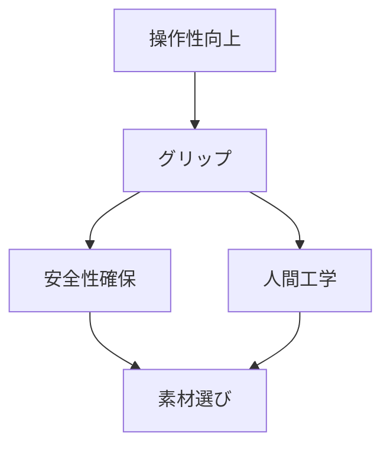

# Day 039: グリップの役割

ハンドルや取手、つまみといった部品の中で、特に重要な役割を果たすのが「グリップ」です。グリップは、手で握る部分のことを指し、操作性や安全性に大きく影響します。今回は、グリップの役割について詳しく解説します。

## グリップの基本的な役割

1. **操作性の向上**  
   グリップは、手でしっかりと握ることができるように設計されています。これにより、機械や装置をスムーズに操作することができます。例えば、ドアの取手や機械のハンドルなど、日常的に使用する多くの場面でその効果が発揮されます。

2. **安全性の確保**  
   滑りにくい素材や形状のグリップは、手が滑ることを防ぎます。これにより、誤操作や事故を未然に防ぐことができます。特に工場や現場での使用においては、グリップの安全性が非常に重要です。

3. **人間工学に基づく設計**  
   人間工学に基づいて設計されたグリップは、長時間の使用でも疲れにくく、手に負担がかからないようになっています。これにより、作業効率が向上し、作業者の疲労を軽減することができます。

## グリップの設計要素

- **素材**: ゴムやプラスチック、金属など、用途に応じた素材が選ばれます。ゴムは滑りにくく、プラスチックは軽量で、金属は耐久性があります。
- **形状**: 手の形にフィットするように設計されており、丸みを帯びた形状や凹凸のあるデザインが一般的です。
- **表面加工**: 滑り止め加工や指の形に合わせた凹凸が施されていることが多いです。

## 図で理解する

## 今日のポイント
- グリップは操作性を高める
- 安全性を確保する役割
- 人間工学に基づく設計

## 明日へのつながり
明日は、グリップの素材選びがどのように作業効率に影響するかを探ります。
