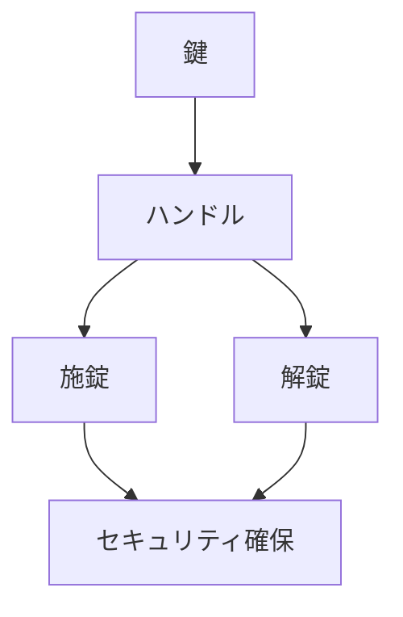

# Day 040: 鍵付きハンドルの考え方

鍵付きハンドルは、産業用機器や家具などで使用される重要な部品です。このハンドルは、施錠と解錠の機能を持ち、セキュリティを確保しつつ、使用者に利便性を提供します。鍵付きハンドルの基本的な考え方を理解することで、その仕組みや役割を把握し、適切な選定や使用が可能になります。

鍵付きハンドルは、通常、以下のような構造を持っています。まず、ハンドル自体が回転することによって扉や蓋を開閉できるようになっています。この回転を制御するために、鍵が使用されます。鍵を差し込んで回すことで、ハンドルの回転をロックまたは解除することができます。

鍵付きハンドルの主な用途は、機器や収納スペースのセキュリティを確保することです。例えば、工場の機械装置やオフィスの保管庫など、特定の人だけがアクセスできるようにしたい場所に使用されます。これにより、無断でのアクセスを防ぎ、機密情報や貴重品の保護が可能となります。

鍵付きハンドルの選定においては、使用環境や求められるセキュリティレベルに応じたものを選ぶことが重要です。例えば、屋外で使用する場合は耐候性のある素材が求められますし、高セキュリティが必要な場合は、複雑な鍵構造を持つものが適しています。

鍵付きハンドルの設置には、取り付け位置や方向、操作のしやすさも考慮する必要があります。これにより、使用者が簡単に施錠・解錠できるようになり、日常の操作性が向上します。

## 図で理解する

## 今日のポイント
- 鍵付きハンドルはセキュリティと利便性を提供
- 鍵でハンドルの回転を制御し施錠・解錠
- 使用環境に応じた選定が重要

## 明日へのつながり
次回は、ハンドルの素材選定について学び、環境に適した部品選びの重要性を探ります。
