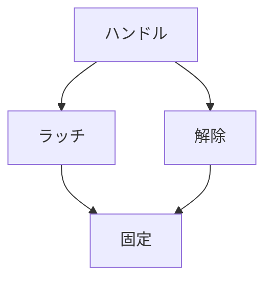

# Day 041: ラッチ一体型ハンドル

ラッチ一体型ハンドルは、扉やフタの開閉時に使用される部品で、ハンドルとラッチ（掛け金）が一体化したものです。この仕組みは、扉やフタを閉じた状態で固定し、必要に応じて簡単に開けることができるように設計されています。ラッチとは、扉やフタが閉じたときに自動的に掛かる部品で、開ける際にはハンドルを操作することで解除されます。

## ラッチ一体型ハンドルの仕組み

ラッチ一体型ハンドルは、次のような特徴があります。

1. **一体化した構造**: ハンドルとラッチが一体化しているため、別々に取り付ける必要がなく、取り付けが簡単です。また、設置スペースを節約できます。

2. **操作の簡便さ**: ハンドルを引く、または回すだけでラッチが解除され、扉やフタを開けることができます。これにより、操作が直感的で素早く行えます。

3. **安全性の向上**: ラッチがしっかりと掛かることで、扉やフタが不意に開くのを防ぎます。例えば、振動が多い環境でもしっかりと固定されます。

ラッチ一体型ハンドルは、工業用機械や設備の扉、キャビネット、収納ボックスなど、様々な場面で使用されています。特に、頻繁に開閉する必要があるが、しっかりと固定しておきたい箇所に適しています。

## 図で理解する

## 今日のポイント
- ラッチ一体型ハンドルは開閉と固定を一体化
- 操作が簡単で直感的
- 安全性を向上させる

## 明日へのつながり
明日は、ラッチ一体型ハンドルがどのように異なる環境で使われるか、具体的な応用例を探ります。
