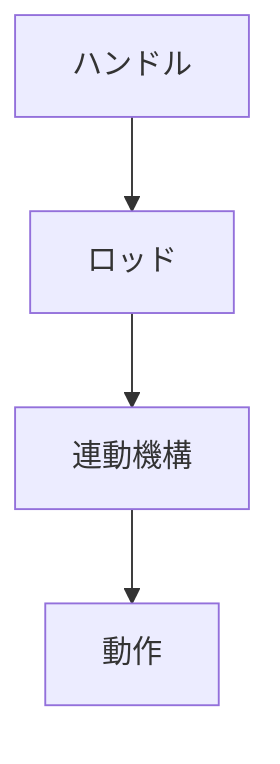

# Day 042: ロッド連動ハンドルの仕組み

ロッド連動ハンドルは、特定の動作を行うためにハンドルの回転や引き動作がロッド（細長い棒）を介して他の機構に伝わる仕組みを持つハンドルです。この仕組みは、工場の機械や大型の収納設備などでよく見られます。図面が読めなくても、その基本的な動きと役割を理解することができます。

## ロッド連動ハンドルの基本構造

ロッド連動ハンドルは、主に以下の要素で構成されています：

1. **ハンドル**: 人が直接操作する部分です。回転や引き動作を行います。
2. **ロッド**: ハンドルの動きを伝えるための棒状の部品です。ハンドルに接続され、動作を他の機構に伝えます。
3. **連動機構**: ロッドの動きを受けて、特定の動作を行う機構です。例えば、扉を開けたり、ロックを解除したりします。

## 動作の流れ

ハンドルを操作すると、その動きがロッドに伝わります。ロッドは直線的に動くことが多く、その動きが連動機構に伝わることで、目的の動作が行われます。例えば、ハンドルを回すことでロッドが引かれ、扉のロックが解除されるといった動きです。

## 利用例

ロッド連動ハンドルは、以下のような場面で利用されます：

- **工場の機械**: 安全カバーを開ける際に、ハンドルを回すとロッドが動いてロックを解除します。
- **大型収納設備**: 一度の操作で複数のロックを同時に解除するために、ロッドを介して動作を連動させます。

## 図で理解する

## 今日のポイント
- ロッド連動ハンドルは動作を伝える仕組み
- ハンドル操作がロッドを介して機構に伝わる
- 工場や収納設備で多用される

## 明日へのつながり

明日は、ロッド連動ハンドルがどのようにして安全性を高めるのかについて詳しく学びます。
