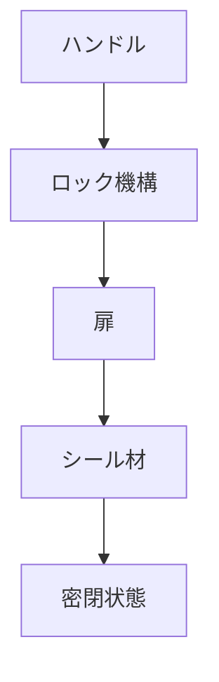

# Day 043: 密閉用ハンドルとは

密閉用ハンドルは、産業用機器や装置の扉や蓋をしっかりと閉じるために使用される重要な部品です。このハンドルは、特に気密性や防水性が求められる場面で活躍します。例えば、電気機器の制御盤や冷蔵庫の扉などで使用され、内部を外部環境から守る役割を果たします。

## 密閉用ハンドルの仕組み

密閉用ハンドルは、単に扉を開け閉めするだけでなく、扉をしっかりと押し付けることで、隙間をなくし密閉状態を作り出します。これにより、外部からの水や空気の侵入を防ぎ、内部の環境を一定に保つことができます。

### 主な特徴

1. **ロック機能**: 密閉用ハンドルには、しっかりと扉を固定するためのロック機能が備わっています。これは、扉が不意に開くのを防ぎ、内部の安全を確保します。

2. **シール材の使用**: 扉と枠の接触部分にはシール材が使用されることが多く、これが気密性や防水性を高める役割を果たします。

3. **調整可能な圧力**: 一部の密閉用ハンドルは、扉を押し付ける圧力を調整できる機能があり、これにより異なる密閉度が求められる場面に対応できます。

## 図で理解する

## 今日のポイント
- 密閉用ハンドルは気密性を確保
- ロック機能で扉を固定
- シール材で防水性を向上

## 明日へのつながり
次回は、密閉用ハンドルと組み合わせて使用されることの多い「シール材」の種類と役割について学びます。
