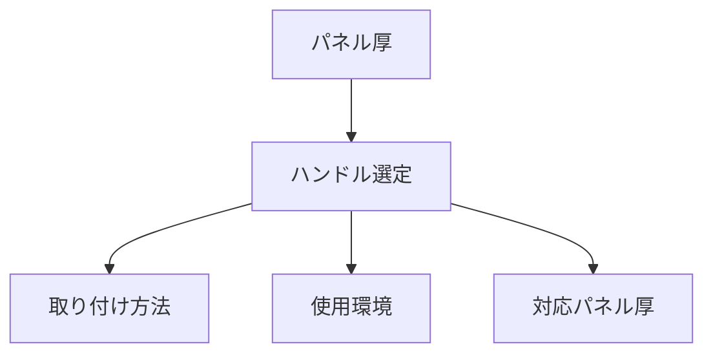

# Day 044: パネル厚とハンドル選定

産業用機器や家具の設計において、ハンドルや取手、つまみを選定する際には「パネル厚」が重要な要素となります。パネル厚とは、ハンドルを取り付ける対象の板や扉の厚さのことを指します。適切なパネル厚に対応したハンドルを選ぶことで、取り付けの安定性や操作性が向上します。

## パネル厚の重要性

ハンドルや取手は、パネルにしっかりと固定される必要があります。パネル厚が適切でないと、取り付けが不安定になり、使用中に外れたり、操作がしづらくなることがあります。特に、重い扉や頻繁に開閉するパネルでは、しっかりとした取り付けが求められます。

## ハンドル選定の基準

1. **対応パネル厚の確認**: 各ハンドル製品には、対応可能なパネル厚の範囲が指定されています。これを確認し、取り付け対象のパネル厚に合った製品を選びましょう。

2. **取り付け方法の確認**: ハンドルの取り付け方法は、ネジ止めやクリップ式などがあります。パネルの素材や使用環境に応じて、適切な取り付け方法を選びます。

3. **使用環境の考慮**: 屋内外の使用、湿度や温度の変化など、使用環境によっても適したハンドルが異なります。耐久性や素材を考慮して選定しましょう。

## 図で理解する

## 今日のポイント
- パネル厚はハンドル選定で重要
- 対応パネル厚を必ず確認
- 使用環境に応じた選定が必要

## 明日へのつながり
明日は、ハンドルの取り付け方法の詳細について学びます。取り付けの安定性を高めるための具体的な技術を紹介します。
