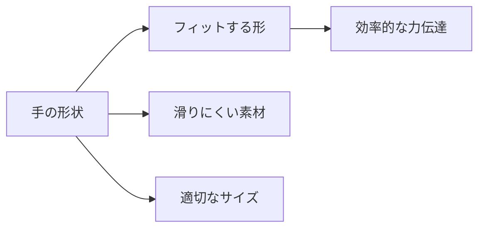

# Day 045: 握りやすさ（人間工学）

ハンドルや取手、つまみは、日常的に手に触れる部品であり、その「握りやすさ」は非常に重要です。握りやすさは、単に手にフィットする形状だけでなく、力の伝わり方や使い勝手に大きく影響します。ここでは、人間工学に基づいた設計の基本を学び、どのようにしてこれらの部品が使いやすくデザインされているかを理解しましょう。

## 人間工学とは

人間工学（エルゴノミクス）は、人間の身体や動作に基づいて製品や環境を設計する学問です。ハンドルや取手の設計においては、手の形状や力の入れ方を考慮し、長時間使用しても疲れにくい形状が求められます。

## 握りやすさの要素

1. **形状**: 手にフィットする形状は、握りやすさの基本です。丸みを帯びたデザインや、指が自然に収まる凹凸のある形状が一般的です。

2. **素材**: 滑りにくい素材や、手触りの良い素材が選ばれます。ゴムや樹脂は、手に優しい感触を提供し、滑り止め効果もあります。

3. **サイズ**: 手の大きさに合ったサイズが重要です。大きすぎると握りにくく、小さすぎると力が入りにくくなります。

## 力の伝わり方

ハンドルや取手は、力を効率よく伝えることが求められます。例えば、レバー式のハンドルは、少ない力で大きな動きを実現するために設計されています。これにより、ユーザーは無理なく操作が可能です。

## 図で理解する

## 今日のポイント
- 人間工学は手に優しい設計の基礎
- 形状・素材・サイズが握りやすさを左右
- 力の伝わり方が使いやすさに影響

## 明日へのつながり
明日は、これらの握りやすさを考慮したハンドルや取手の具体的な応用例について学びます。
