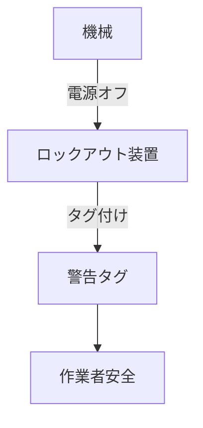

# Day 046: ロックアウト/タグアウトの基礎

ロックアウト/タグアウト（Lockout/Tagout、以下LOTO）は、産業現場で作業者の安全を確保するための重要な手法です。特に機械や設備のメンテナンス時に、誤って機械が動き出さないようにするために使われます。ハンドルや取手、つまみといった部品も、この手法において重要な役割を果たします。

## ロックアウトとは？

ロックアウトは、機械や設備のエネルギー源を物理的に遮断することを指します。具体的には、電源スイッチをオフにした後、鍵付きの装置でそのスイッチを固定し、再びオンにできないようにします。このとき、ハンドルやつまみがロック装置の一部として使われることがあります。例えば、電源ボックスのハンドルをロックすることで、誰も電源を入れられないようにするのです。

## タグアウトとは？

タグアウトは、ロックアウトが行われていることを示すための視覚的な警告です。ロックアウト装置にタグ（札）を取り付け、誰が、いつ、なぜロックアウトを行っているのかを明示します。これにより、他の作業者が誤って装置を操作しないように注意を促します。タグは通常、目立つ色や形状をしており、重要な情報が記載されています。

## ロックアウト/タグアウトの重要性

LOTOは、作業者の安全を守るために不可欠です。機械が誤作動を起こすと、重大な事故につながる可能性があります。LOTOを適切に実施することで、こうしたリスクを大幅に減少させることができます。特に、複数の作業者が関与する大規模な現場では、LOTOの徹底が求められます。

## 図で理解する

## 今日のポイント
- ロックアウトは物理的に電源を遮断
- タグアウトは視覚的警告で安全確保
- LOTOで作業者の安全を守る

## 明日へのつながり
明日は、ハンドルや取手の素材選定について学びます。安全性や耐久性に影響する要素を確認しましょう。
