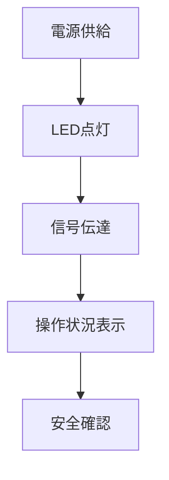

# Day 047: 指示灯付きハンドル

指示灯付きハンドルは、機械や設備の操作状況を視覚的に確認できる機能を備えたハンドルです。通常のハンドルにLEDなどの指示灯が組み込まれており、操作中や異常時に光で知らせる役割を果たします。これにより、オペレーターは遠くからでも機械の状態を把握でき、安全性と効率性が向上します。

## 指示灯付きハンドルの仕組み

指示灯付きハンドルは、以下のような仕組みで動作します。

1. **電源供給**: 指示灯には電源が必要です。通常、機械本体から電源が供給され、ハンドルを通じて指示灯に電力が送られます。
   
2. **LEDの点灯**: 指示灯にはLEDが使用されることが多く、長寿命で省エネです。LEDは、操作状況に応じて点灯や点滅を行います。

3. **信号の伝達**: 機械の状態を示す信号がハンドルに伝達され、指示灯が点灯します。例えば、機械が稼働中であれば緑色、異常が発生した場合は赤色に点灯するなど、色や点滅パターンで状況を示します。

## 指示灯付きハンドルの用途

このハンドルは、工場の生産ラインや大型設備の制御盤、または安全性が重視される場面で広く使用されます。特に、以下のような用途で効果を発揮します。

- **安全確認**: 操作中の機械の状態を一目で確認できるため、誤操作や事故を未然に防ぐことができます。
- **効率的な管理**: オペレーターが遠くからでも機械の状態を確認できるため、効率的な管理が可能です。
- **異常時の迅速対応**: 異常が発生した際にすぐに気づけるため、迅速な対応が可能です。

## 図で理解する

## 今日のポイント
- 指示灯付きハンドルは視覚的確認が可能
- LEDで操作状況を示す
- 安全性と効率性を向上

## 明日へのつながり
明日は、ハンドルの素材選びとその影響について学びます。これにより、適切なハンドル選定の基礎を築きます。
