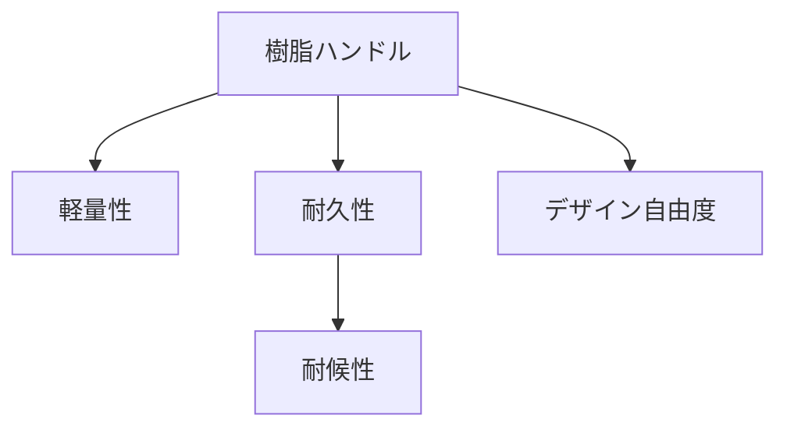

# Day 048: 樹脂ハンドルの特徴

樹脂ハンドルは、産業用機構部品の中でも軽量で扱いやすい素材として広く利用されています。樹脂とは、プラスチックとも呼ばれる化学合成された材料で、金属に比べて加工が容易で、コストが低く抑えられるという特徴があります。

## 樹脂ハンドルの主な特徴

1. **軽量性**  
   樹脂は金属に比べて非常に軽く、使用する機器全体の重量を抑えることができます。このため、持ち運びが頻繁な機器や、取り付けが高所にある場合などに適しています。

2. **耐久性と耐候性**  
   樹脂は一般に耐久性があり、特に耐候性（天候の変化に対する耐性）に優れています。紫外線や湿気に強い素材を選ぶことで、屋外での使用にも適しています。

3. **デザインの自由度**  
   樹脂は成形が容易で、複雑な形状や多様な色を実現できます。これにより、機器のデザインに合わせたカスタマイズが可能です。また、表面に滑り止め加工を施すなど、機能性を高めることもできます。

## 樹脂の種類と用途

樹脂には、アクリル、ポリカーボネート、ナイロンなど、さまざまな種類があります。それぞれの樹脂には特有の特性があり、用途に応じて選択することが重要です。例えば、耐衝撃性が求められる場合にはポリカーボネートが適していますし、耐熱性が必要な場合にはナイロンが選ばれることが多いです。

## 図で理解する

## 今日のポイント
- 樹脂ハンドルは軽量で扱いやすい
- 耐久性と耐候性に優れる
- デザインの自由度が高い

## 明日へのつながり
明日は、樹脂ハンドルの具体的な選定方法について学びます。用途に応じた最適な選択ができるようにしましょう。
