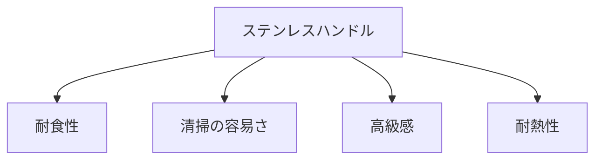

# Day 049: ステンレスハンドルの特徴

ステンレスハンドルは、産業用機器や設備において非常に人気のある選択肢です。その理由は、ステンレスという素材が持つ特性にあります。ステンレスは鉄を基にした合金で、クロムを含むことで錆びにくい性質を持っています。このため、ステンレスハンドルは耐久性が高く、長期間使用しても劣化しにくいという利点があります。

まず、ステンレスハンドルの最大の特徴はその耐食性です。錆びにくいという性質は、湿度の高い環境や水に触れる可能性のある場所で特に重要です。例えば、食品加工設備や医療機器など、衛生管理が重要な分野では、ステンレスの耐食性が大いに役立ちます。また、屋外で使用される機器にも適しています。

次に、ステンレスハンドルは清掃が容易であることも大きな利点です。表面が滑らかで汚れが付きにくく、簡単に拭き取ることができます。これにより、メンテナンスの手間を大幅に減らすことができ、長期的なコスト削減にもつながります。

さらに、ステンレスハンドルは見た目にも優れています。光沢のある仕上げは高級感を演出し、機器全体のデザインを引き立てます。これにより、ステンレスハンドルは機能性だけでなく、デザイン性も兼ね備えた選択肢として評価されています。

最後に、ステンレスハンドルは耐熱性にも優れています。高温環境でも変形しにくく、安定した性能を発揮します。これにより、工場や製造現場など、過酷な条件下でも安心して使用することができます。

## 図で理解する

## 今日のポイント
- ステンレスは錆びにくく耐久性が高い
- 清掃が簡単で衛生的
- 高級感がありデザイン性も優れる

## 明日へのつながり
明日は、ハンドルの取り付け方法について学びます。適切な取り付けは、ハンドルの性能を最大限に引き出します。
