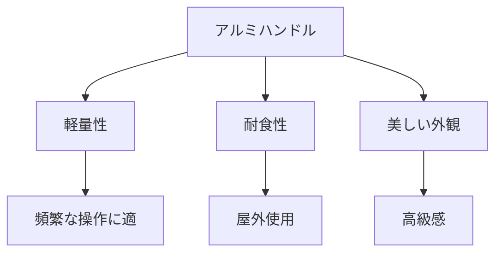

# Day 050: アルミハンドルの特徴

アルミハンドルは、産業用機械や設備に広く使用される部品の一つです。アルミニウムは軽量でありながら強度があるため、ハンドルとして非常に適しています。今日は、アルミハンドルの特徴について詳しく見ていきましょう。

## アルミハンドルの利点

1. **軽量性**  
   アルミニウムは鉄やステンレスに比べて非常に軽い金属です。このため、アルミハンドルは機械や設備の重量を増やさずに取り付けることができます。軽量であることは、特に頻繁に操作する必要がある場所での使用において重要です。

2. **耐食性**  
   アルミニウムは自然に酸化被膜を形成し、腐食から保護します。この特性により、アルミハンドルは湿気や化学物質にさらされる環境でも長期間使用できます。特に屋外や化学工場などでの使用において、この耐食性は大きなメリットです。

3. **美しい外観**  
   アルミニウムは加工しやすく、表面を美しく仕上げることができます。アルマイト処理（酸化被膜を人工的に厚くする処理）を施すことで、さらに耐久性と美観を向上させることができます。これにより、見た目の美しさを求める製品にも適しています。

## アルミハンドルの用途

アルミハンドルは、軽量性と耐久性を活かして、様々な用途で使用されています。例えば、電子機器のケースや産業用の機械、さらには家具や建築物のドアハンドルとしても利用されています。これらの用途では、軽さと耐食性が特に重要視されます。

## 図で理解する

## 今日のポイント
- アルミハンドルは軽量で操作が容易
- 耐食性が高く、過酷な環境でも使用可能
- 美しい外観でデザイン性も優れている

## 明日へのつながり
明日は、異なる素材のハンドルとその用途について比較し、どのように選択するかを学びます。これにより、適切なハンドル選びの基礎を築きましょう。
